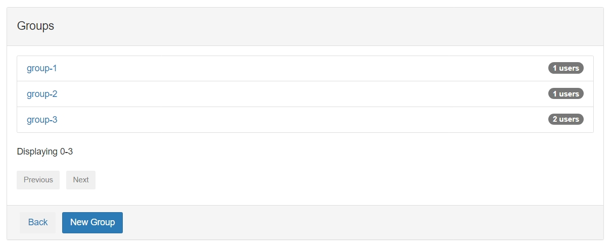
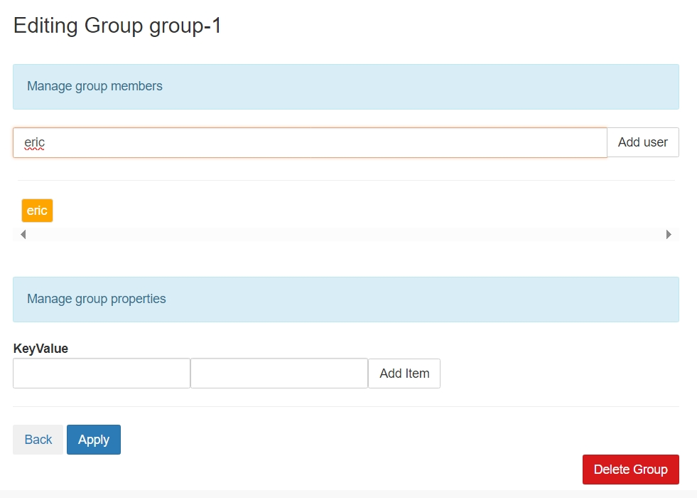
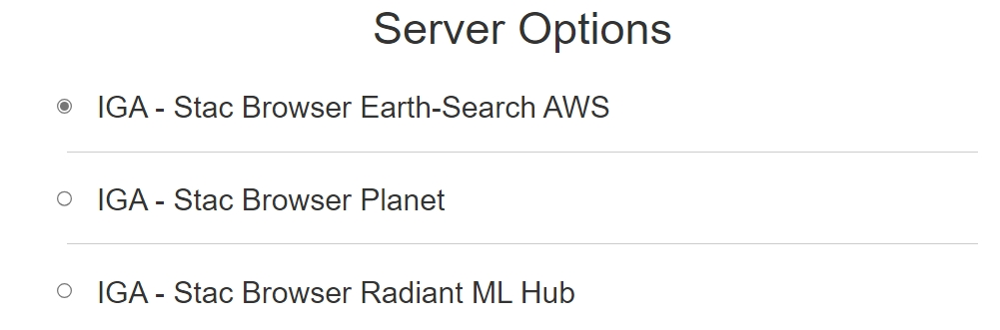
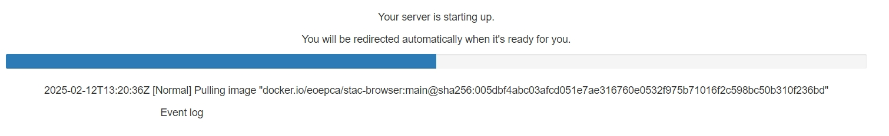

# Application Hub Deployment Guide

> **OIDC** is currently a requirement for the Application Hub. This is a work in progress and will be updated in the future.

The **Application Hub** provides a suite of web-based tools—like JupyterLab and Code Server—for interactive analysis and application development on Earth Observation (EO) data. It can also host custom dashboards and interactive web apps

---

## Introduction

The Application Hub Building Block provides JupyterLab notebooks, Code Server and custom web applications for EO data analysis and processing.

The building block offers:

- JupyterLab for interactive data analysis and notebook execution
- Code Server for browser-based development environments
- Multi-user support with profile-based resource allocation
- Group-based access control for different user categories
- Integration with OIDC for authentication
- Persistent storage for user workspaces
- Customisable container images per profile

---

## Prerequisites

Before deploying the Application Hub, ensure you have the following:

| Component          | Requirement                            | Documentation Link                                                |
| ------------------ | -------------------------------------- | ----------------------------------------------------------------- |
| Kubernetes         | Cluster (tested on v1.32)              | [Installation Guide](../prerequisites/kubernetes.md)             |
| Helm               | Version 3.8 or newer                   | [Installation Guide](https://helm.sh/docs/intro/install/)         |
| kubectl            | Configured for cluster access          | [Installation Guide](https://kubernetes.io/docs/tasks/tools/)     |
| Ingress Controller | Properly installed (NGINX or APISIX)   | [Installation Guide](../prerequisites/ingress/overview.md)       |
| TLS Certificates   | Managed via `cert-manager` or manually | [TLS Certificate Management Guide](../prerequisites/tls.md)      |
| OIDC Provider      | Keycloak or compatible                 | [IAM Deployment Guide](../building-blocks/iam/main-iam.md)       |
| Storage Class      | For persistent volumes                 | Default or custom storage class                                  |

**Clone the Deployment Guide Repository:**
```bash
git clone https://github.com/EOEPCA/deployment-guide
cd deployment-guide/scripts/app-hub
```

**Validate your environment:**

Run the validation script to ensure all prerequisites are met:
```bash
bash check-prerequisites.sh
```

---

## Deployment Steps

### 1. Run the Configuration Script

```bash
bash configure-app-hub.sh
```

**Core Configuration Parameters**

During the script execution, you will be prompted to provide:

- **`INGRESS_HOST`**: Base domain for ingress hosts.
    - *Example*: `example.com`
- **`PERSISTENT_STORAGECLASS`**: Storage class for persistent volumes.
    - *Example*: `standard`
- **`CLUSTER_ISSUER`** (if using `cert-manager`): Name of the ClusterIssuer.
    - *Example*: `letsencrypt-http01-apisix`
- **`NODE_SELECTOR_KEY`**: Determine which nodes will run the Application Hub pods.
    - *Example*: `kubernetes.io/os`
    - *Read more*: [Node Selector Documentation](https://kubernetes.io/docs/concepts/scheduling-eviction/assign-pod-node/#nodeselector)
- **`NODE_SELECTOR_VALUE`**: Value for the node selector key.
    - *Example*: `linux`

**OIDC Configuration (We will set this up in the next step)**:

- **`KEYCLOAK_HOST`**: OIDC provider base domain will be asked if this hasn't been set. JupyterHub requires an OIDC provider for authentication.
    - *Example*: `auth.example.com` 
- **`APPHUB_CLIENT_ID`**: Client ID for the OIDC provider.
    - *Example*: `application-hub`

---

2. **Configure OIDC Provider**:

To enable Jupyter notebooks and other interactive services to authenticate users, you must integrate the Application Hub with an OIDC identity provider:

Use the `create-client.sh` script in the `/scripts/utils/` directory. This script prompts you for basic details and automatically creates a Keycloak client in your chosen realm:

```bash
bash ../utils/create-client.sh
```

When prompted:

- **Keycloak Admin Username and Password**: Enter the credentials of your Keycloak admin user (these are also in `~/.eoepca/state` if you have them set).
- **Keycloak base domain**: e.g. `auth.example.com`
- **Realm**: Typically `eoepca`.

- **Confidential Client?**: specify `true` to create a CONFIDENTIAL client
- **Client ID**: `application-hub`.
- **Client name** and **description**: Provide any helpful text (e.g `Application Hub Client`).
- **Client secret**: Enter the Client Secret that was generated during the configuration script (check `~/.eoepca/state`).
- **Subdomain**: Use `app-hub` for the OAPIP engine. 
- **Additional Subdomains**: Leave blank.
- **Additional Hosts**: Leave blank.

After it completes, you should see a JSON snippet confirming the newly created client.

---

3. **Deploy the Application Hub Using Helm**

```bash
helm repo add eoepca https://eoepca.github.io/helm-charts
helm repo update eoepca
helm upgrade -i application-hub eoepca/application-hub \
--version 2.1.0 \
--values generated-values.yaml \
--namespace application-hub \
--create-namespace
```

#### Configure Ingress
```bash
kubectl apply -f generated-ingress.yaml
```

---

4. **Create an admin user**

By default, the Application Hub has a **demo** admin user named `eric`. You will need to create this user in Keycloak (or your OIDC provider) to access the Application Hub admin.

```
bash ../utils/create-user.sh
```

When prompted, fill out the general Keycloak authentication details (if not already set) and then:

- **Username**: `eric`
- **Password**: Choose a secure password.

> Alternatively you can create this user through the Keycloak admin interface.


5. **Create Groups in AppHub**

Once `eric` has been created, navigate to the Application Hub admin panel: 

```
https://app-hub.${INGRESS_HOST}/hub/admin
```

- **Log in** with the `eric` user.

- Select **> Manage Groups** and create the following groups with this exact naming:

    - `group-1`
    - `group-2`
    - `group-3`



6. **Assign Users to Groups**

Individually assign the `eric` user to each group and hit **Apply**.




7. **Select a Profile**

Return to the primary Application Hub interface (`https://app-hub.${INGRESS_HOST}/`) and log in as `eric`.

You should now see a list of the preconfigured profiles. Select one to spawn an application profile.



8. **Launch a Profile**

Select one of the profiles to launch a profile. You will then be redirected to the relevant tooling environment.




***
---

## 5. Validation

### 5.1 Automated Validation

Run validation:
```bash
bash validation.sh
```

### 5.2 Manual Validation

1. **Check Kubernetes Resources**:
    
```bash
kubectl get pods -n application-hub
```

Ensure the JupyterHub pod(s) and other components are in the `Running` state.
    
2. **Access the Hub**:
    
- Go to `https://app-hub.${INGRESS_HOST}/`.
- You should be redirected to Keycloak (or your chosen OIDC provider) for login if OIDC is set up.
- Upon successful login, you'll land in the JupyterHub interface (the "spawn" page).

3. **Spawn a Notebook**:

> While this Building Block is still in development, the following steps may not work as expected. This section will be updated in the future.

- If you have multiple **Profiles**, pick one.
- Wait for the container to start. You should end up in a JupyterLab interface.

If something fails (e.g. a 401 from Keycloak or a "profile list is empty" error), review the logs:

```bash
kubectl logs -n application-hub <application-hub-pod-name>
```

---

## 6. Advanced Configuration

Check the [JupyterHub Configuration Reference](https://eoepca.github.io/application-hub-context/configuration/) for more advanced settings and options.

***
## Uninstallation

To uninstall the Application Hub and clean up associated resources:

```
helm uninstall application-hub -n application-hub
```

***
## Further Reading

- [Application Hub Design Document](https://eoepca.readthedocs.io/projects/application-hub/en/latest/)
- [EOEPCA+ Helm Charts Repository](https://github.com/EOEPCA/helm-charts)
- [EOEPCA+ Deployment Guide Repository](https://github.com/EOEPCA/deployment-guide)
- [JupyterLab Documentation](https://jupyterlab.readthedocs.io/en/stable/)

***
## Feedback

If you encounter any issues or have suggestions for improvement, please open an issue on the [EOEPCA+Deployment Guide GitHub Repository](https://github.com/EOEPCA/deployment-guide/issues).