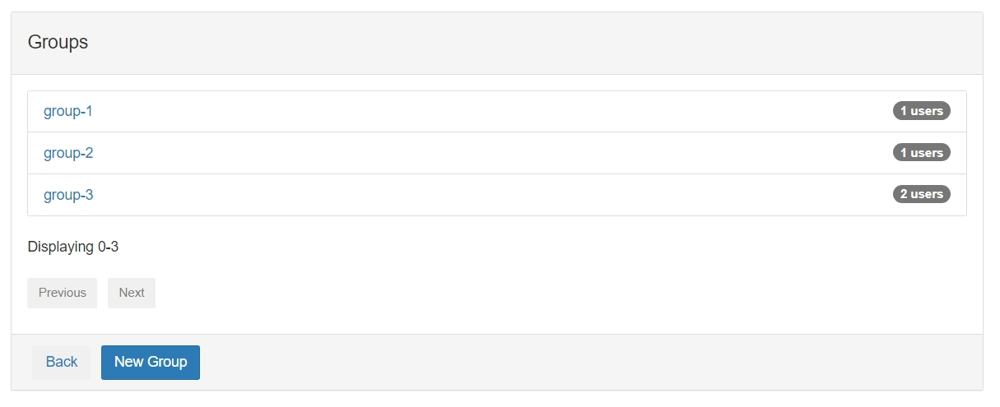
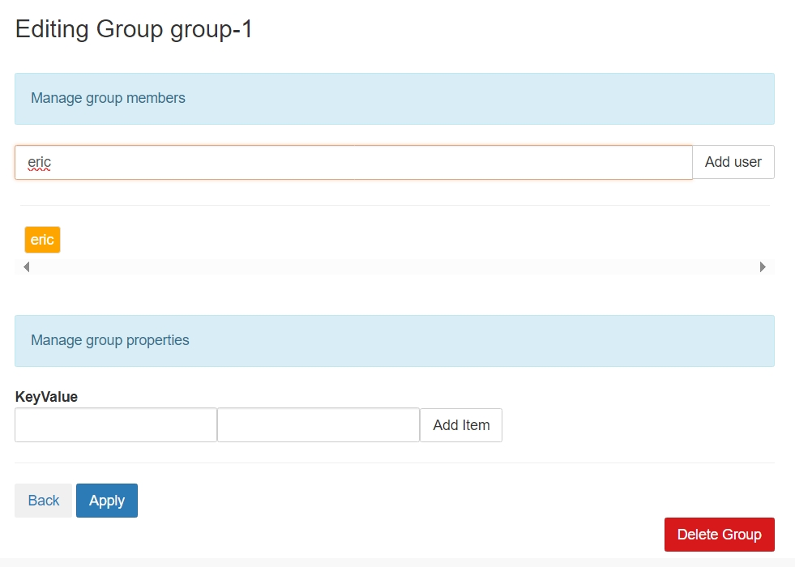
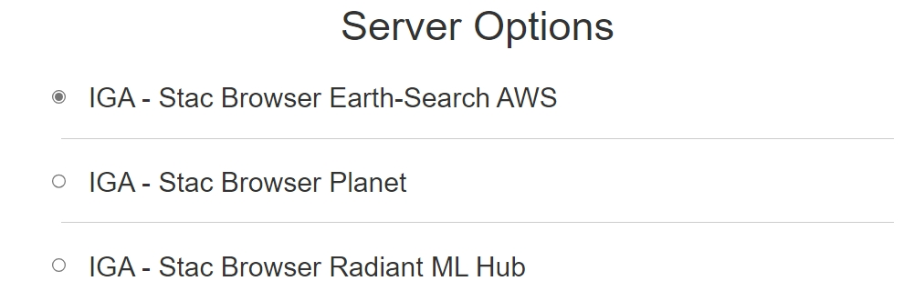
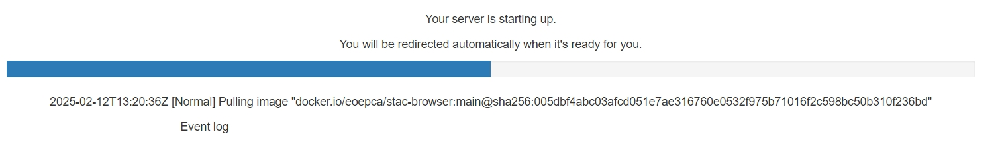

# Application Hub Deployment Guide

!!! warning
    Application Hub 2.1 requires OIDC. The IAM-off mode is not supported by this guide.

The **Application Hub** provides a suite of web-based tools—like JupyterLab and Code Server—for interactive analysis and application development on Earth Observation (EO) data. It can also host custom dashboards and interactive web apps.

---

## Introduction

The Application Hub Building Block provides JupyterLab notebooks, Code Server and custom web applications for EO data analysis and processing.

The building block offers:

- JupyterLab for interactive data analysis and notebook execution
- Code Server for browser-based development environments
- Multi-user support with profile-based resource allocation
- Group-based access control for different user categories
- Integration with OIDC for authentication
- Persistent storage for user workspaces
- Customisable container images per profile

---

## Prerequisites

Before deploying the Application Hub, ensure you have the following:

| Component          | Requirement                            | Documentation Link                                               |
| ------------------ | -------------------------------------- | ---------------------------------------------------------------- |
| Kubernetes         | Cluster (tested on v1.32)              | [Installation Guide](../prerequisites/kubernetes.md)             |
| Helm               | Version 3.8 or newer                   | [Installation Guide](https://helm.sh/docs/intro/install/)        |
| kubectl            | Configured for cluster access          | [Installation Guide](https://kubernetes.io/docs/tasks/tools/)    |
| Ingress Controller | Properly installed (NGINX or APISIX)   | [Installation Guide](../prerequisites/ingress/overview.md)       |
| TLS Certificates   | Managed via `cert-manager` or manually | [TLS Certificate Management Guide](../prerequisites/tls.md)      |
| OIDC Provider      | Keycloak or compatible                 | [IAM Deployment Guide](../building-blocks/iam/main-iam.md)       |
| Storage Class      | For persistent volumes                 | Default or custom storage class                                  |
| Crossplane         | Required only for the generated Keycloak client manifest | [Installation Guide](../prerequisites/crossplane.md) |

**Clone the Deployment Guide Repository:**
```bash
git clone https://github.com/EOEPCA/deployment-guide
cd deployment-guide/scripts/app-hub
```

**Validate your environment:**

Run the validation script to ensure all prerequisites are met:
```bash
bash check-prerequisites.sh
```

---

## Deployment Steps

### 1. Run the Configuration Script

```bash
bash configure-app-hub.sh
```

**Core Configuration Parameters**

You'll be asked for, in order (`HTTP_SCHEME` and `INGRESS_CLASS` only if not already set from a prior Building Block):

- **`HTTP_SCHEME`**: `http` or `https`.
- **`INGRESS_CLASS`**: `apisix` or `nginx`.
- **`INGRESS_HOST`**: Base domain for ingress hosts.
    - *Example*: `example.com`
- **`PERSISTENT_STORAGECLASS`**: Storage class for persistent volumes.
    - *Example*: `standard`
- **`CLUSTER_ISSUER`** (if using `cert-manager`): Name of the ClusterIssuer.
    - *Example*: `letsencrypt-http01-apisix`
- **`NODE_SELECTOR_KEY`**: Determine which nodes will run the Application Hub pods.
    - *Example*: `kubernetes.io/os`
    - *Read more*: [Node Selector Documentation](https://kubernetes.io/docs/concepts/scheduling-eviction/assign-pod-node/#nodeselector)
- **`NODE_SELECTOR_VALUE`**: Value for the node selector key.
    - *Example*: `linux`
- **`APPHUB_PUBLIC_HOST`**: Public Application Hub host. Defaults to `app-hub.${INGRESS_HOST}`.
    - *Example*: `app-hub.example.com`
- **`APPHUB_CLIENT_ID`**: Client ID for the OIDC provider.
    - *Example*: `application-hub`
- **`KEYCLOAK_HOST`**: OIDC provider base domain, only asked if not already set. JupyterHub requires an OIDC provider for authentication.
    - *Example*: `auth.example.com`
- **`REALM`**: Keycloak realm, only asked if not already set.
    - *Example*: `eoepca`

`APPHUB_CLIENT_SECRET` and `APPHUB_JUPYTERHUB_CRYPT_KEY` are generated and stored in `~/.eoepca/state`.

The script renders:

- `generated-values.yaml`
- `generated-ingress.yaml`
- `generated-iam.yaml`

---

### 2. Create the Keycloak Client

To enable Jupyter notebooks and other interactive services to authenticate users, create an OIDC client in Keycloak.

If you deployed the EOEPCA IAM Building Block with the Crossplane Keycloak provider, apply the generated manifest:

```bash
kubectl apply -f generated-iam.yaml
```

The generated client uses the exact JupyterHub callback URL:

```bash
source ~/.eoepca/state
echo "${HTTP_SCHEME}://${APPHUB_PUBLIC_HOST}/hub/oauth_callback"
```

For an external OIDC provider, create an equivalent confidential client manually with that redirect URI and the client secret from `APPHUB_CLIENT_SECRET`.

### 3. Apply Application Hub Secrets

Create the Kubernetes Secret consumed by the Helm release:

```bash
bash apply-secrets.sh
```

### 4. Deploy the Application Hub Using Helm

```bash
helm repo add eoepca https://eoepca.github.io/helm-charts
helm repo update eoepca
helm upgrade -i application-hub eoepca/application-hub \
--version 2.1.0 \
--values generated-values.yaml \
--namespace app-hub \
--create-namespace
```

#### Configure Ingress

```bash
kubectl apply -f generated-ingress.yaml
```

### 5. Create an admin user

By default, the Application Hub has a **demo** admin user named `eric`. You will need to create this user in Keycloak (or your OIDC provider) to access the Application Hub admin.

The user can be created declaratively using the CRD defined by the Crossplane Keycloak provider. A `Secret` is used to inject the password securely. `configure-app-hub.sh` already rendered `generated-demo-user.yaml` for this.

```bash
kubectl apply -f generated-demo-user.yaml
```

!!! tip
    Alternatively you can create this user through the Keycloak admin interface.

### 6. Create Groups in AppHub

Once `eric` has been created, navigate to the Application Hub admin panel: 

```bash
source ~/.eoepca/state
echo "${HTTP_SCHEME}://${APPHUB_PUBLIC_HOST}/hub/admin"
```

- **Log in** as the `eric` user - using the password from the state file (`~/.eoepca/state`) variable `KEYCLOAK_TEST_PASSWORD`.

- Select **> Manage Groups** and create the following groups with this exact naming:

    - `group-1`
    - `group-2`
    - `group-3`

!!! note
    These groups are simply examples that are configured into the default deployment. This default configuration should be adapted for your platform deployment.



### 7. Assign Users to Groups

Individually assign the `eric` user to each group and hit **Apply**.




### 8. Select a Profile

Return to the primary Application Hub interface and log in as `eric`.

Selecting `Start My Server` - you should now see a list of the preconfigured profiles. Select one to spawn an application profile.

!!! note
    These preconfigured profiles are simply examples that are configured into the default deployment. These default profiles should be adapted for your platform deployment.



### 9. Launch a Profile

Select one of the profiles to launch a profile. You will then be redirected to the relevant tooling environment.



---

## Validation

### 1 Automated Validation

Run validation:
```bash
bash validation.sh
```

### 2 Manual Validation

1. **Check Kubernetes Resources**:
    
```bash
kubectl get pods -n app-hub
```

Ensure the JupyterHub pod(s) and other components are in the `Running` state.
    
2. **Access the Hub**:
    
- Go to `${HTTP_SCHEME}://${APPHUB_PUBLIC_HOST}/`.
- You should be redirected to Keycloak (or your chosen OIDC provider) for login.
- Upon successful login, you'll land in the JupyterHub interface (the "spawn" page).

3. **Spawn a Notebook**:

- If you have multiple **Profiles**, pick one.
- Wait for the container to start. You should end up in a JupyterLab interface.

If something fails (e.g. a 401 from Keycloak or a "profile list is empty" error), review the logs:

```bash
kubectl logs -n app-hub deploy/application-hub-hub
```

---

## Advanced Configuration

Check the [JupyterHub Configuration Reference](https://eoepca.github.io/application-hub-context/configuration/) for more advanced settings and options.

***
## Uninstallation

To uninstall the Application Hub and clean up associated resources:

```bash
helm uninstall application-hub -n app-hub
kubectl delete ingress application-hub -n app-hub
kubectl delete -f generated-iam.yaml --ignore-not-found
kubectl delete -f generated-demo-user.yaml --ignore-not-found
```

***
## Further Reading

- [Application Hub Design Document](https://eoepca.readthedocs.io/projects/application-hub/en/latest/)
- [EOEPCA+ Helm Charts Repository](https://github.com/EOEPCA/helm-charts)
- [EOEPCA+ Deployment Guide Repository](https://github.com/EOEPCA/deployment-guide)
- [JupyterLab Documentation](https://jupyterlab.readthedocs.io/en/stable/)

***
## Feedback

If you encounter any issues or have suggestions for improvement, please open an issue on the [EOEPCA+Deployment Guide GitHub Repository](https://github.com/EOEPCA/deployment-guide/issues).
