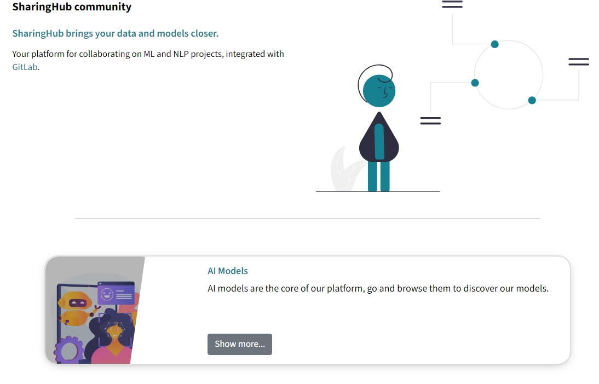
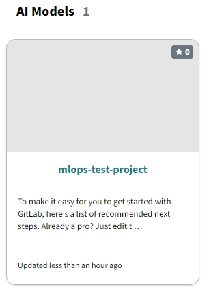
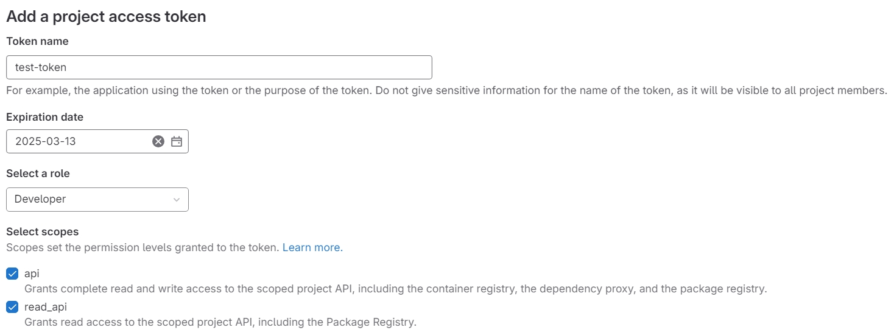
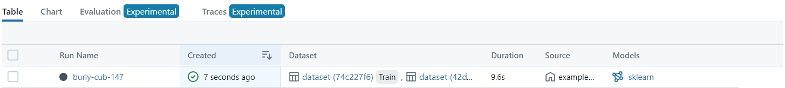
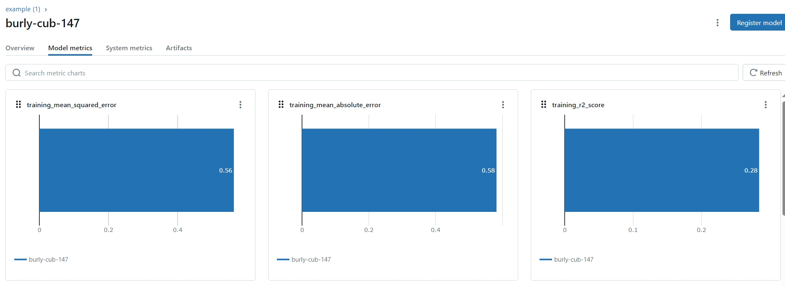

# MLOps Deployment Guide

The **MLOps Building Block** provides support services for training machine learning models within the cloud platform. It orchestrates the training of ML models across popular frameworks, maintains a history of training runs with associated metrics, and manages the associated training data. This guide provides step-by-step instructions to deploy the MLOps Building Block within your Kubernetes cluster.

---

## Introduction

The **MLOps Building Block** provides integrated services for training and managing machine learning models within the EOEPCA+ environment. It leverages GitLab for code and data versioning, **SharingHub** for collaborative ML services, and **MLflow SharingHub** (a custom MLflow) for experiment tracking and model registry.

### Key Features

- **End-to-End** ML Workflow: Data versioning, model training, experiment logging, model deployment or registry.  
- **GitLab Integration**: Automatic linking of GitLab projects (public or private) into SharingHub for discoverability. 
- **OIDC Authentication**: Via Keycloak or compatible OIDC provider (optional but highly recommended).  
- **S3 / MinIO Storage**: Flexible object storage for large data and model artifacts.  


---
## Prerequisites

Before deploying the MLOps Building Block, ensure you have the following:

| Component        | Requirement                            | Documentation Link                                                                            |
| ---------------- | -------------------------------------- | --------------------------------------------------------------------------------------------- |
| Kubernetes       | Cluster (tested on v1.28)              | [Installation Guide](../prerequisites/kubernetes.md)                                         |
| Git              | Properly installed                     | [Installation Guide](https://git-scm.com/book/en/v2/Getting-Started-Installing-Git)                                     |
| Helm             | Version 3.5 or newer                   | [Installation Guide](https://helm.sh/docs/intro/install/)                                     |
| Helm plugins     | `helm-git`: Version 1.3.0 tested       | [Installation Guide](https://github.com/aslafy-z/helm-git?tab=readme-ov-file#install)                                     |
| kubectl          | Configured for cluster access          | [Installation Guide](https://kubernetes.io/docs/tasks/tools/)                                 |
| Ingress          | Properly installed                     | [Installation Guide](../prerequisites/ingress/overview.md) |
| TLS Certificates | Managed via `cert-manager` or manually | [TLS Certificate Management Guide](../prerequisites/tls.md)                             |
| MinIO            | S3-compatible storage                  | [Installation Guide](../prerequisites/minio.md)                |

Additionally, you must have:

- **Keycloak** (or another OIDC provider) set up *if* you want single sign-on through OIDC.  
  - If you do not integrate OIDC, GitLab will use its default authentication method (username/password). However, SharingHub can still use GitLab for sign-in via an access token or GitLab OAuth app.


**Clone the Deployment Guide Repository:**

```bash
git clone https://github.com/EOEPCA/deployment-guide
cd deployment-guide/scripts/mlops
```

**Validate your environment:**

Run the validation script to ensure all prerequisites are met:

```bash
bash check-prerequisites.sh
```

---

## Deployment Steps


### 1. Run the Configuration Script

The configuration script will prompt you for necessary configuration values, generate secret keys, and create configuration files for GitLab, SharingHub, and MLflow SharingHub.

```bash
bash configure-mlops.sh
```

**Configuration Parameters**

During the script execution, you will be prompted to provide:

- **`INGRESS_HOST`**: Base domain for ingress hosts.
    - *Example*: `example.com`
- **`CLUSTER_ISSUER`**: Cert-manager Cluster Issuer for TLS certificates.
    - *Example*: `letsencrypt-http01-apisix`

The S3 environment variables should be already set after successful deployment of the [Minio Building Block]():

- **`S3_ENDPOINT`**: Endpoint URL for MinIO or S3-compatible storage.
    - *Example*: `https://minio.example.com`
- **`S3_REGION`**: Region of your S3 storage.
    - *Example*: `us-east-1`
- **`S3_ACCESS_KEY`**: Access key for your MinIO or S3 storage.
- **`S3_SECRET_KEY`**: Secret key for your MinIO or S3 storage.
- **`S3_BUCKET_SHARINGHUB`**: Name of the S3 bucket to be used by SharingHub.
    - *Example*: `mlopbb-sharinghub`
- **`S3_BUCKET_MLFLOW`**: Name of the S3 bucket to be used by MLFlow.
    - *Example*: `mlopbb-mlflow-sharinghub`


**OIDC Configuration (Optional):**

If you are using the APISIX Ingress, you will be prompted to provide whether you wish to enable OIDC authentication. If you **don't** want to enable OIDC, enter `false` when prompted.

- **`OIDC_ISSUER_URL`**: The URL of your OpenID Connect provider (e.g., Keycloak).
    - *Example*: `https://keycloak.example.com/realms/eoepca`
- **`Client ID`**: Use `gitlab`.

For instructions on how to set up IAM, you can follow the [IAM Building Block](./iam/main-iam.md) guide. You will create a client in the next step.

### 2. Create a Keycloak Client for GitLab (Optional)

If you **don't** want to enable OIDC or you are **not** using the APISIX ingress controller, you can skip directly to [Create Required Kubernetes Secrets](#3-create-required-kubernetes-secrets).

Use the `create-client.sh` script in the `/scripts/utils/` directory. This script prompts you for basic details and automatically creates a Keycloak client in your chosen realm:

```bash
bash ../utils/create-client.sh
```

When prompted:

- **Keycloak Admin Username and Password**: Enter the credentials of your Keycloak admin user (these are also in `~/.eoepca/state` if you have them set).
- **Keycloak base domain**: e.g. `auth.example.com`
- **Realm**: Typically `eoepca`.

- **Confidential Client?**: specify `true` to create a CONFIDENTIAL client
- **Client ID**: You should use `gitlab`.
- **Client name** and **description**: Provide any helpful text (e.g., `GitLab OIDC Client`).
- **Client secret**: Enter the Client Secret that was generated during the configuration script (check `~/.eoepca/state`).
- **Subdomain**: Use `gitlab`
- **Additional Subdomains**: Leave blank.
- **Additional Hosts**: Leave blank.

After it completes, you should see a JSON snippet confirming the newly created client.


### 3. Create Required Kubernetes Secrets

Navigate back to the `deployment-guide/scripts/mlops` directory and apply the generated secrets:

```bash
bash apply-secrets.sh
```

### 4. Deploy GitLab

Deploy GitLab using the generated configuration file. This deployment can take up to 10 minutes, please be patient.

```bash
helm repo add gitlab https://charts.gitlab.io/
helm repo update gitlab
helm upgrade -i gitlab gitlab/gitlab \
  --version 9.1.4 \
  --namespace gitlab \
  --create-namespace \
  --values gitlab/generated-values.yaml
```

**Important Notice Regarding GitLab Deployment:**

> **Note**: The provided GitLab deployment uses built-in PostgreSQL, Redis, and Gitaly. These are **evaluation-only** components. For production setups, reference GitLab's official docs on external databases, Redis clusters, etc.


### 4. Set Up GitLab OAuth Application for SharingHub

Once GitLab is deployed and accessible (this may take about 5 minutes), follow these steps to configure an OAuth application for SharingHub authentication.

#### 4.1 Retrieve the GitLab Root Password

Before logging in, fetch the GitLab root password:

```bash
kubectl get secret gitlab-gitlab-initial-root-password --template={{.data.password}} -n gitlab | base64 -d
```

Save this password securely for the next step.

#### 4.2 Log In to GitLab

1. Open your browser and navigate to:  
    `https://gitlab.${INGRESS_HOST}`
2. Log in using the username `root` and the retrieved password.

#### 4.3 Access the OAuth Application Settings

1. In the bottom-left corner of GitLab, select **Admin**.
2. In the Admin Area sidebar, click on **Applications**.
3. Then click **Add New Application** to create a new OAuth app.

#### 4.4 Configure the OAuth Application

Fill out the new application form with the following details:

- **Name**:  
    Enter a descriptive name, e.g., `SharingHub`.
    
- **Redirect URI**:
    
    ```
    https://sharinghub.${INGRESS_HOST}/api/auth/login/callback
    ```
    
- **Scopes**:  
    Select all of the following:
    
    - `api`
    - `read_api`
    - `read_user`
    - `read_repository`
    - `write_repository`
    - `openid`
    - `profile`
    - `email`

After confirming all details, click **Save Application**.

#### 4.5 Save the Application Credentials

Once the application is created, GitLab will display the **Application ID** and **Secret**. **Record these credentials securely**, as they are required later to configure SharingHub's OAuth integration.

### 5 Store the GitLab OAuth App Credentials

```bash
bash utils/save-application-credentials-to-state.sh
```

This script prompts you for `GITLAB_APP_ID` and `GITLAB_APP_SECRET` from the step above, then creates a Kubernetes secret (`sharinghub-oidc`) in the `sharinghub` namespace. This allows SharingHub to use GitLab-based OIDC sign-in.

### 6. Deploy SharingHub Using Helm

```bash
helm repo add sharinghub "git+https://github.com/csgroup-oss/sharinghub@deploy/helm?ref=0.4.1"
helm repo update sharinghub
helm upgrade -i sharinghub sharinghub/sharinghub \
  --namespace sharinghub \
  --create-namespace \
  --values sharinghub/generated-values.yaml
```

#### Deploy Ingress for the SharingHub

**APISIX only** - If you are using NGINX or another ingress controller, you can skip this step.

```
kubectl apply -f sharinghub/generated-ingress.yaml
```

### 7. Deploy MLflow SharingHub Using Helm

```bash
helm repo add mlflow-sharinghub "git+https://github.com/csgroup-oss/mlflow-sharinghub@deploy/helm?ref=0.2.0"
helm repo update mlflow-sharinghub
helm upgrade -i mlflow-sharinghub mlflow-sharinghub/mlflow-sharinghub \
  --namespace sharinghub \
  --create-namespace \
  --values mlflow/generated-values.yaml
```


#### Deploy Ingress for the MLFlow

**Note:** The following ingress configuration applies to both **NGINX** and **APISIX** ingress controllers. Ensure your ingress controller is properly set up before applying the configuration.

```
kubectl apply -f mlflow/generated-ingress.yaml
```

### 8. Deploy Postgres for MLflow SharingHub (if not using an external database)

```
kubectl apply -f mlflow/postgres-deployment.yaml
```

---

### 1. Validate the Deployment

Before contiuning to the **Basic Usage Walkthrough**, run a few checks:

1. **Check Pods**:
```bash
kubectl get pods -n gitlab
kubectl get pods -n sharinghub
```
All pods should be in `Running` (or `Completed`) state.

2. **Visit GitLab**:

- `https://gitlab.${INGRESS_HOST}/`
- Log in with `root` user.

3. **Visit SharingHub**:

- `https://sharinghub.${INGRESS_HOST}/`
- If you set up GitLab OAuth for SharingHub, you should see a sign-in flow redirecting to GitLab.

4. **Visit MLflow**:

- `https://sharinghub.${INGRESS_HOST}/mlflow/`
- Confirm the MLflow UI loads.

5. **Confirm S3 Access**:

    Using `s3cmd` CLI...<br>
    _If credentials or bucket aren't set correctly, then you'll see an error_

    ```bash
    source ~/.eoepca/state
    s3cmd ls s3://mlopbb-sharinghub \
    --host minio.${INGRESS_HOST} \
    --host-bucket minio.${INGRESS_HOST} \
    --access_key "${MINIO_USER}" \
    --secret_key "${MINIO_PASSWORD}"
    ```

    Repeat for bucket `s3://mlopbb-mlflow-sharinghub`.

---

### 2. Test Suite Execution

Run the _MLOps_ tests from the system test suite.

```bash
../../test-suite.sh test/mlops
```

**_The test results are summarised to the file `test-report.xml`._**

---

### 3. Basic Usage Walkthrough

This section walks you through a minimal scenario of creating a GitLab project, tagging it for discovery in SharingHub, and running a simple MLflow training job.

#### 2.1 Create a New GitLab Project

1. **Log into GitLab**

    > These steps assume that the `eoepcauser` test user was created in the earlier IAM setup steps, and that the Gitlab instance has been integrated with Keycloak via OIDC.

    * Open the Gitlab UI - `https://gitlab.${INGRESS_HOST}/`
    * Select to `Sign in with EOEPCA` (Sign out of `root` user if necessary)
    * Login as user `eoepcauser` (or another user, visit the IAM deployment guide for user creation steps)
    
2. **Create the Project**
    
    - Click **Create a Project** → **Create blank project** and enter the name: `mlops-test-project`.
    - The project URL should reflect the current user - e.g. `https://gitlab.${INGRESS_HOST}/eoepcauser/`
    - Set the project visibility to **Public**.
    - Click **Create project**.

3. **Add the SharingHub Topic**
    
    - In your project's sidebar, go to **Settings → General**.
    - Locate the **Topics** section and add the topic:  
        `sharinghub:aimodel`  
    - Click **Save changes**.

#### 2.2 Verify that the Project Appears in SharingHub

4. **Open SharingHub**  
    `https://sharinghub.${INGRESS_HOST}/`
    
5. **Sign in with GitLab**
    
    - Click the login button in the top-right corner.
    - Sign into Gitlab via EOEPCA as before<br>
      _Note that if the Gitlab session is still active, then this will be automatic_

6. **Locate Your Project**
    
    - Click the **AI Models** category (or the category you used), or visit:  
        `https://sharinghub.${INGRESS_HOST}/ui/#/ai-model`

      


    - After clicking the **AI Models** card, You should see the new project (`mlops-test-project`) in the listing.
    
    
    
    _If you do not see your project, double-check that the GitLab topic matches the configuration in `sharinghub/generated-values.yaml` (under `config.stac.categories.ai-model.gitlab_topic`)._
    

#### 2.3 MLflow Setup & Training

7. **Obtain the MLflow Tracking URI**
    
    - In SharingHub, open your project details.
        
    - Click the **MLflow** link in the top-right corner.
        
        
        
    - The link will resemble:
        
        ```
        https://sharinghub.${INGRESS_HOST}/mlflow/eoepcauser/mlops-test-project/tracking/
        ```
        
    - Set this as an environment variable:
        
        ```bash
        export MLFLOW_TRACKING_URI="https://sharinghub.${INGRESS_HOST}/mlflow/eoepcauser/mlops-test-project/tracking/"
        ```
        
8. **Authenticate and Retrieve a Token**
    
    - In GitLab, navigate to your project's Access Tokens page:  
        `https://gitlab.${INGRESS_HOST}/eoepcauser/mlops-test-project/-/settings/access_tokens`
        
    - Click **Add new token**.
        
    - Create a token with the **Developer** role and the scopes `read_api, api`.
        
        
        
    - Set the token as an environment variable:
        
        ```bash
        export MLFLOW_TRACKING_TOKEN="<YOUR-TOKEN>"
        ```
        
9. **Run a Simple MLflow Experiment**
    
    > It is assumed that a python virtual environment is established for the following steps.<br>
    > For example, using the `venv` module...
    > ```bash
    > python -m venv venv
    > source venv/bin/activate
    > ```

    - Ensure you have the required packages:
        
        ```bash
        pip install mlflow scikit-learn
        ```
        
    - Run the provided example script located in the `data/` directory of `deployment-guide/scripts/mlops`:
        
        ```bash
        cd data/
        python example-script.py
        ```
        
    - This script will:
        - Load the `data/wine-quality.csv` dataset.
        - Train a simple model.
        - Log parameters, metrics, and the model into MLflow.

10. **Check the MLflow UI**
    
    - Open your browser and navigate to:  
        `https://sharinghub.${INGRESS_HOST}/mlflow/`
        
    - In the left panel under **Experiments**, look for your project.
        
    - You should see a new run:
        
          

    - Click the run to see the logged metrics and artifacts.

        

    > If you don't see the run, but the script ran successfully, check that you are logged into the SharingHub via Gitlab and that the project is correctly tagged.<br>Refresh the browser view if necessary.

---

## Uninstallation

To uninstall the MLOps Building Block and clean up associated resources:

```bash
helm uninstall gitlab -n gitlab
helm uninstall sharinghub mlflow-sharinghub -n sharinghub
bash utils/uninstallation-cleanup.sh
kubectl delete ns gitlab sharinghub
```

---

## Further Reading

- [SharingHub Documentation](https://github.com/csgroup-oss/sharinghub)
- [MLflow SharingHub Documentation](https://github.com/csgroup-oss/mlflow-sharinghub)
- [EOEPCA+Helm Charts Repository](https://github.com/EOEPCA/helm-charts)

---

## Feedback

If you have any issues or suggestions, please open an issue on the [EOEPCA+Deployment Guide Repository](https://github.com/EOEPCA/deployment-guide/issues).
