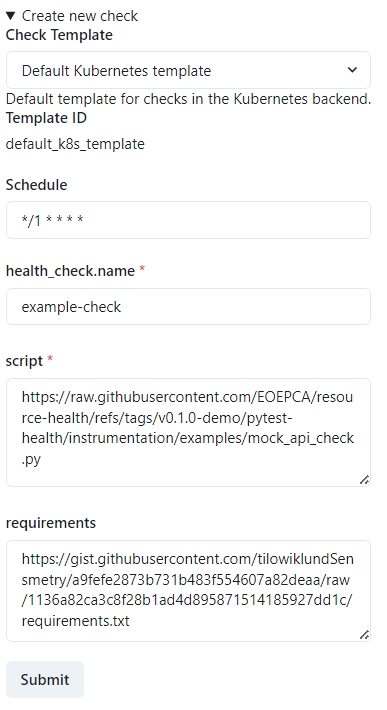

# Resource Health Deployment Guide

The **Resource Health** Building Block (BB) provides a flexible framework for monitoring the health and status of resources within the EOEPCA platform. This includes core platform services as well as derived or user-provided resources such as datasets, workflows, or user applications.

---

## Introduction

The **Resource Health BB** allows you to:

- **Define and schedule** automated health checks (e.g. daily, hourly).
- **Observe and visualise** check outcomes via a web dashboard.
- **Integrate with external services** (e.g. IAM for OIDC authentication, Data Access, Resource Catalogue).
- **Store results** in OpenSearch, optionally visualizing them using OpenSearch Dashboards.
- **Collect telemetry** via OpenTelemetry, enabling advanced monitoring and alerting.

---

## Components Overview

1. **Resource Health Web**
    
- Dashboard and front-end for viewing health checks and results.
- By default, can be secured with OIDC authentication (e.g. via Keycloak).

2. **Resource Health API(s)**
    
- **Telemetry API** for gathering check results and metrics.
- **Health Checks API** (Check Manager) for listing, scheduling, and managing checks.

3. **Health Check Runner**
    
- A flexible engine that executes your custom health checks at scheduled intervals.

4. **Mock API** (optional sample)
    
- An example test resource used in demonstration checks (e.g. an hourly check to a mock endpoint).

5. **OpenSearch & OpenSearch Dashboards**

- Stores logs, results, and trace data from your checks.
- Provides advanced visualisation and analytics features.

6. **OpenTelemetry Collector**
    
- Receives telemetry from health checks and forward them to OpenSearch.

---

## Prerequisites

Before deploying the Resource Health Building Block, ensure you have the following:

| Component                   | Requirement                             | Documentation Link                                                |
| --------------------------- | --------------------------------------- | ----------------------------------------------------------------- |
| Kubernetes                  | Cluster (tested on v1.28)               | [Installation Guide](../prerequisites/kubernetes.md) |
| Git                         | Properly installed                      | [Installation Guide](https://git-scm.com/book/en/v2/Getting-Started-Installing-Git) |
| Helm                        | Version 3.5 or newer                    | [Installation Guide](https://helm.sh/docs/intro/install/)         |
| Helm plugins                | `helm-git`: Version 1.3.0 tested        | [Installation Guide](https://github.com/aslafy-z/helm-git?tab=readme-ov-file#install) |
| kubectl                     | Configured for cluster access           | [Installation Guide](https://kubernetes.io/docs/tasks/tools/)     |
| Ingress Controller          | Properly installed (e.g., NGINX)        | [Installation Guide](../prerequisites/ingress/overview.md)      |
| Internal TLS Certificates   | ClusterIssuer for internal certificates | [Internal TLS Setup](../prerequisites/tls.md#internal-tls) |

**Clone the Deployment Guide Repository:**

```bash
git clone https://github.com/EOEPCA/deployment-guide
cd deployment-guide/scripts/resource-health
```

**Validate your environment:**

```bash
bash check-prerequisites.sh
```

This script checks common prerequisites, including your Kubernetes/Helm installation, Git, and any required Helm plugins.

---

## Deployment Steps

### 1. Run the Configuration Script

The `configure-resource-health.sh` script gathers basic configuration inputs (such as your internal ClusterIssuer for TLS, storage class, etc.) and generates a `generated-values.yaml` that tailors the Resource Health deployment to your environment.

```bash
bash configure-resource-health.sh
```

During execution, you will be prompted for:

- **`INGRESS_HOST`**: Hostname.
- **`INTERNAL_CLUSTER_ISSUER`**: Name of the cert-manager ClusterIssuer for internal TLS. (Default: `eoepca-ca-clusterissuer`)
- **`STORAGE_CLASS`**: Storage class for persistent volumes. (Default: `standard`)

---

### 2. Create a Keycloak Client

Use the `create-client.sh` script in the `/scripts/utils/` directory. This script prompts you for basic details and automatically creates a Keycloak client in your chosen realm:

```bash
bash ../utils/create-client.sh
```

When prompted:

- **Keycloak Admin Username and Password**: Enter the credentials of your Keycloak admin user (these are also in `~/.eoepca/state` if you have them set).
- **Keycloak base domain**: e.g. `auth.example.com`
- **Realm**: Typically `eoepca`.

- **Confidential Client?**: specify `true` to create a CONFIDENTIAL client
- **Client ID**: For the Resource Health, you should use `resource-health`.
- **Client name** and **description**: Provide any helpful text (e.g. `Resource Health`).
- **Client secret**: Enter the Client Secret that was generated during the configuration script (check `~/.eoepca/state`).
- **Subdomain**: Use `resource-health`. 
- **Additional Subdomains**: Leave blank.
- **Additional Hosts**: Leave blank.

After it completes, you should see a JSON snippet confirming the newly created client.

---

### 3. Deploy the Resource Health BB (Helm)

1. **Apply Secrets**

```bash
bash apply-secrets.sh
```
This script creates the necessary secrets for the Resource Health BB.


2. **Install or upgrade Resource Health**

> **Note**: While the Resource Health BB is not yet in the official EOEPCA Helm charts, you can install it directly from the GitHub repository.

- Clone the Resource Health repository and update dependencies:
```bash
git clone -b 2.0.0-rc1 https://github.com/EOEPCA/resource-health.git reference-repo
helm dependency update reference-repo/resource-health-reference-deployment
```

- Install or upgrade the Resource Health Helm chart:
```bash
helm upgrade -i resource-health reference-repo/resource-health-reference-deployment \
  -f generated-values.yaml \
  -n resource-health --create-namespace
```

> As part of this deployment, you will have a preconfigured healthcheck that runs every minute. 

---

### 3. Configure Ingress

By default, Resource Health is designed to be flexible with Ingress and OIDC configurations.

For the purpose of this guide, the configuration script created a sample Ingress resource in `generated-ingress.yaml` that you can apply or adapt to your environment. The output depends on the ingress controller you have set in the `~/.eoepca/state` file.

- **APISIX**

    ```bash
    kubectl apply -f apisix/plugin-api-auth.yaml -n resource-health
    kubectl apply -f apisix/plugin-browser-auth.yaml -n resource-health
    kubectl apply -f generated-ingress.yaml -n resource-health
    ```

- **Nginx**

    ```bash
    kubectl apply -f generated-ingress.yaml -n resource-health
    ```

---

### 4. Monitor the Deployment

Once deployed, you will have to wait a minute until the first health check runs before you can access the Resource Health Web dashboard.

After the Helm installation finishes, check that all pods are running in the **resource-health** namespace:

```bash
kubectl get all -n resource-health
```

---

## Validation

1. **Run the validation script**:
    
```bash
bash validation.sh
```

2. **Access the Resource Health Web**:

Access the Resource Health Web dashboard at:

```url
https://resource-health.${INGRESS_HOST}
```


Access the Health Checks at:

```url
https://resource-health.${INGRESS_HOST}/api/healthchecks/checks/
```

Check the Telemetry service status at:

```url
https://resource-health.${INGRESS_HOST}/api/telemetry/healthz
```

---

## Usage

### 1. Defining Health Checks

Health checks are typically defined in the Helm chart’s values under `resource-health.healthchecks.checks`. Each check has:

- **name**
- **schedule** (a cron expression like `"@hourly"` or `"0 8 * * *"`)
- **requirements** (optional Python packages)
- **script** (the actual test logic)
- **env** (environment variables, e.g. references to external services)

## Defining Health Checks

**Helm-based** (preferred for GitOps or static config):

```yaml
resource-health:
  healthchecks:
    checks:
      - name: daily-trivial-check
        schedule: "0 8 * * *"
        requirements: "https://example.com/requirements.txt"
        script: "https://example.com/trivial_check.py"
        env:
          - name: SOME_HOST
            value: "https://some-endpoint.example.com"
```

Apply with:

```bash
helm upgrade -i resource-health reference-repo/resource-health-reference-deployment -f generated-values.yaml -n resource-health
```

**UI-based** (via the Resource Health Web):

Visit the Resource Health Web dashboard and select the **Create new check** dropdown to define a new health check.

Fill in the form similarly to the Helm-based approach, including the template, schedule, name, script and requirements.



---

## Uninstallation

To remove all Resource Health components and the namespace:

```bash
helm uninstall resource-health -n resource-health
kubectl delete namespace resource-health
```

---

## Further Reading

- [EOEPCA+ Resource Health GitHub](https://github.com/EOEPCA/resource-health)
- [EOEPCA+ Helm Charts](https://eoepca.github.io/helm-charts)
- [EOEPCA+ Deployment Guide Repository](https://github.com/EOEPCA/deployment-guide)
- [OpenSearch Documentation](https://opensearch.org/docs/)
- [OpenTelemetry Documentation](https://opentelemetry.io/)
