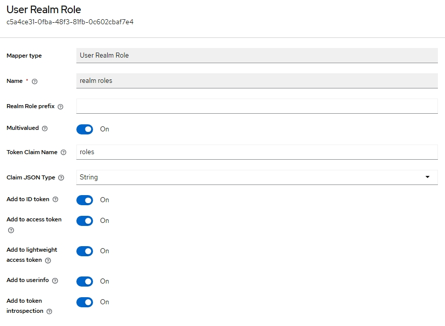
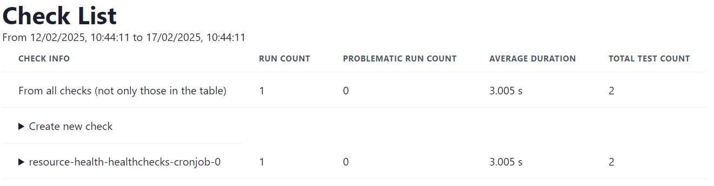

# Resource Health Deployment Guide

The **Resource Health** Building Block (BB) provides a flexible framework for monitoring the health and status of resources within the EOEPCA platform. This includes core platform services as well as derived or user-provided resources such as datasets, workflows, or user applications.

---

## Introduction

The **Resource Health BB** allows you to:

- **Define and schedule** automated health checks (e.g. daily, hourly).
- **Observe and visualise** check outcomes via a web dashboard.
- **Integrate with external services** (e.g. IAM for OIDC authentication, Data Access, Resource Catalogue).
- **Store results** in OpenSearch, optionally visualizing them using OpenSearch Dashboards.
- **Collect telemetry** via OpenTelemetry, enabling advanced monitoring and alerting.

---

## Components Overview

1. **Resource Health Web**
    
- Dashboard and front-end for viewing health checks and results.
- By default, can be secured with OIDC authentication (e.g. via Keycloak).

2. **Resource Health API(s)**
    
- **Telemetry API** for gathering check results and metrics.
- **Health Checks API** (Check Manager) for listing, scheduling, and managing checks.

3. **Health Check Runner**
    
- A flexible engine that executes your custom health checks at scheduled intervals.

4. **Mock API** (optional sample)
    
- An example test resource used in demonstration checks (e.g. an hourly check to a mock endpoint).

5. **OpenSearch & OpenSearch Dashboards**

- Stores logs, results, and trace data from your checks.
- Provides advanced visualisation and analytics features.

6. **OpenTelemetry Collector**
    
- Receives telemetry from health checks and forward them to OpenSearch.

---

## Prerequisites

Before deploying the Resource Health Building Block, ensure you have the following:

| Component                   | Requirement                             | Documentation Link                                                |
| --------------------------- | --------------------------------------- | ----------------------------------------------------------------- |
| Kubernetes                  | Cluster (tested on v1.32)               | [Installation Guide](../prerequisites/kubernetes.md) |
| Git                         | Properly installed                      | [Installation Guide](https://git-scm.com/book/en/v2/Getting-Started-Installing-Git) |
| Helm                        | Version 3.5 or newer                    | [Installation Guide](https://helm.sh/docs/intro/install/)         |
| Helm plugins                | `helm-git`: Version 1.3.0 tested        | [Installation Guide](https://github.com/aslafy-z/helm-git?tab=readme-ov-file#install) |
| kubectl                     | Configured for cluster access           | [Installation Guide](https://kubernetes.io/docs/tasks/tools/)     |
| Ingress Controller          | Properly installed (e.g., NGINX)        | [Installation Guide](../prerequisites/ingress/overview.md)      |
| Internal TLS Certificates   | ClusterIssuer for internal certificates | [Internal TLS Setup](../prerequisites/tls.md#internal-tls) |

**Clone the Deployment Guide Repository:**

```bash
git clone https://github.com/EOEPCA/deployment-guide
cd deployment-guide/scripts/resource-health
```

**Validate your environment:**

```bash
bash check-prerequisites.sh
```

This script checks common prerequisites, including your Kubernetes/Helm installation, Git, and any required Helm plugins.

---

## Deployment Steps

### 1. Run the Configuration Script

The `configure-resource-health.sh` script gathers basic configuration inputs (such as your internal ClusterIssuer for TLS, storage class, etc.) and generates a `generated-values.yaml` that tailors the Resource Health deployment to your environment.

```bash
bash configure-resource-health.sh
```

During execution, you will be prompted for:

- **`INGRESS_HOST`**: Hostname.
- **`INTERNAL_CLUSTER_ISSUER`**: Name of the cert-manager ClusterIssuer for internal TLS. (Default: `eoepca-ca-clusterissuer`)
- **`PERSISTENT_STORAGECLASS`**: Storage class for persistent volumes. (Default: `standard`)

---

### 2. Create a Keycloak Client

Use the `create-client.sh` script in the `/scripts/utils/` directory. This script prompts you for basic details and automatically creates a Keycloak client in your chosen realm:

```bash
bash ../utils/create-client.sh
```

When prompted:

- **Keycloak Admin Username and Password**: Enter the credentials of your Keycloak admin user (these are also in `~/.eoepca/state` if you have them set).
- **Keycloak base domain**: e.g. `auth.example.com`
- **Realm**: Typically `eoepca`.

- **Confidential Client?**: specify `true` to create a CONFIDENTIAL client
- **Client ID**: For the Resource Health, you should use `resource-health`.
- **Client name** and **description**: Provide any helpful text (e.g. `Resource Health`).
- **Client secret**: Enter the Client Secret that was generated during the configuration script (check `~/.eoepca/state`).
- **Subdomain**: Use `resource-health`. 
- **Additional Subdomains**: Leave blank.
- **Additional Hosts**: Leave blank.

After it completes, you should see a JSON snippet confirming the newly created client.

---

### 3. Deploy the Resource Health BB (Helm)

1. **Apply Secrets**

```bash
bash apply-secrets.sh
```
This script creates the necessary secrets for the Resource Health BB.


2. **Install or upgrade Resource Health**

> **Note**: While the Resource Health BB is not yet in the official EOEPCA Helm charts, you can install it directly from the GitHub repository.

- Clone the Resource Health repository and update dependencies:
```bash
git clone -b 2.0.0 https://github.com/EOEPCA/resource-health.git reference-repo
helm dependency update reference-repo/resource-health-reference-deployment
```

- Install or upgrade the Resource Health Helm chart:
```bash
helm upgrade -i resource-health reference-repo/resource-health-reference-deployment \
  -f generated-values.yaml \
  -n resource-health --create-namespace
```

> As part of this deployment, you will have a preconfigured healthcheck that runs every minute. 

---

### 3. Configure Ingress

By default, Resource Health is designed to be flexible with Ingress and OIDC configurations.

For the purpose of this guide, the configuration script created a sample Ingress resource in `generated-ingress.yaml` that you can apply or adapt to your environment. The output depends on the ingress controller you have set in the `~/.eoepca/state` file.

- **APISIX**

```bash
kubectl apply -f apisix/plugin-api-auth.yaml -n resource-health
kubectl apply -f apisix/plugin-browser-auth.yaml -n resource-health
kubectl apply -f generated-ingress.yaml -n resource-health
```

- **Nginx**

```bash
kubectl apply -f generated-ingress.yaml -n resource-health
```

---

### 4. Configure Keycloak Client

To ensure your Keycloak user has proper permissions in OpenSearch, you must configure role mapping explicitly.

#### Step 1: Create a Keycloak Realm Role

* Log into your Keycloak (`auth.${INGRESS_HOST}`).
* Navigate to your realm (`eoepca`).
* Click on **Realm Roles**, then click **Create Role**.
* Create a new role named `opensearch_user`

#### Step 2: Assign the Role to your Keycloak User

* Still in Keycloak, go to **Users** and select your user (e.g. `eoepcauser`).
* Click on the **Role Mappings** tab.
* Assign the newly created `opensearch_user` realm role to this user.

#### Step 3: Add the Realm Role Mapper to your Keycloak Client

* Go to **Clients** and select your `resource-health` client.
* Navigate to **Client Scopes → resource-health-dedicated** and click **Add Mapper**.
* Configure the `User Realm Role` template mapper as follows:

| Field               | Value                |
| ------------------- | -------------------- |
| Mapper Type         | `User Realm Role`    |
| Name                | `realm roles`        |
| Multivalued         | `ON` ✅               |
| Token Claim Name    | `roles`              |
| Claim JSON Type     | `String`             |
| Add to ID token     | `ON` ✅               |
| Add to Access token | `ON` ✅               |
| Add to Userinfo     | `ON` (recommended) ✅ |

This configuration ensures Keycloak will correctly include realm roles in the JWT.



---

### 4. Monitor the Deployment

Once deployed, you will have to wait a minute until the first health check runs before you can access the Resource Health Web dashboard.

After the Helm installation finishes, check that all pods are running in the **resource-health** namespace:

```bash
kubectl get all -n resource-health
```

---

## Deployment Guide Documentation (Improved Usage Section)

```markdown
### 4. Monitor the Deployment

Once deployed, you will have to wait a minute until the first health check runs before you can access the Resource Health Web dashboard.

After the Helm installation finishes, check that all pods are running in the **resource-health** namespace:

```bash
kubectl get all -n resource-health
```

---

## Validation

1. **Run the validation script**:
    
```bash
bash validation.sh
```

2. **Verify the APIs are responding**:

```bash
# Check the Health Checks API
curl -s "https://resource-health.${INGRESS_HOST}/api/healthchecks/" | jq

# Check available templates
curl -s "https://resource-health.${INGRESS_HOST}/api/healthchecks/v1/check_templates/" | jq '.data[].id'

# Check the Telemetry API
curl -s "https://resource-health.${INGRESS_HOST}/api/telemetry/" | jq
```

3. **Access the Resource Health Web**:

Access the Resource Health Web dashboard at:

```
https://resource-health.${INGRESS_HOST}
```



---

## Usage

### Understanding Health Check Templates

Health check templates define reusable patterns for common monitoring scenarios. View available templates:

```bash
curl -s "https://resource-health.${INGRESS_HOST}/api/healthchecks/v1/check_templates/" | jq '.data[] | {id: .id, label: .attributes.metadata.label, description: .attributes.metadata.description}'
```

The default deployment includes:
- **simple_ping** - Checks if an endpoint responds with an expected HTTP status code
- **generic_script_template** - Runs custom pytest scripts for advanced health checks

### Creating Health Checks via API

The Resource Health API uses [JSON:API](https://jsonapi.org/) format. Here's how to create a health check:

**1. Create a health check definition:**

```bash
cat <<EOF > healthcheck.json
{
  "data": {
    "type": "check",
    "attributes": {
      "schedule": "*/5 * * * *",
      "metadata": {
        "name": "my-service-check",
        "description": "Check if my service is responding",
        "template_id": "simple_ping",
        "template_args": {
          "endpoint": "https://my-service.example.com/health",
          "expected_status_code": 200
        }
      }
    }
  }
}
EOF
```

**2. Register the health check:**

```bash
curl -X POST "https://resource-health.${INGRESS_HOST}/api/healthchecks/v1/checks/" \
  -H "Content-Type: application/vnd.api+json" \
  -d @healthcheck.json | jq
```

**3. Verify the check was created:**

```bash
# List all checks
curl -s "https://resource-health.${INGRESS_HOST}/api/healthchecks/v1/checks/" | jq '.data[] | {id: .id, name: .attributes.metadata.name, schedule: .attributes.schedule}'

# View the corresponding CronJob in Kubernetes
kubectl get cronjobs -n resource-health
```

### Triggering Health Checks Manually

Instead of waiting for the scheduled time, you can trigger a health check immediately:

```bash
# Get the check ID
CHECK_ID=$(curl -s "https://resource-health.${INGRESS_HOST}/api/healthchecks/v1/checks/" | jq -r '.data[0].id')

# Create a manual job from the CronJob
kubectl create job --from=cronjob/${CHECK_ID} manual-check -n resource-health

# Wait for completion and view results
kubectl wait --for=condition=complete job/manual-check -n resource-health --timeout=120s
kubectl logs job/manual-check -n resource-health --all-containers | tail -20
```

### Viewing Health Check Results

**Via Telemetry API:**

```bash
curl -s "https://resource-health.${INGRESS_HOST}/api/telemetry/v1/spans/" | jq
```

**Via Web Dashboard:**

Visit `https://resource-health.${INGRESS_HOST}` to see all health checks and their results in a visual interface.

### Deleting Health Checks

```bash
# Get the check ID you want to delete
CHECK_ID=$(curl -s "https://resource-health.${INGRESS_HOST}/api/healthchecks/v1/checks/" | jq -r '.data[] | select(.attributes.metadata.name=="my-service-check") | .id')

# Delete the check
curl -X DELETE "https://resource-health.${INGRESS_HOST}/api/healthchecks/v1/checks/${CHECK_ID}"

# Verify deletion
curl -s "https://resource-health.${INGRESS_HOST}/api/healthchecks/v1/checks/" | jq '.data[].attributes.metadata.name'
```

### Defining Health Checks via Helm

Health checks can also be pre-configured in the Helm values. Add templates under `resource-health.healthchecks.templates`:

```yaml
resource-health:
  healthchecks:
    use_template_configmap: True
    templates:
      my_custom_template.py: |
        import check_backends.k8s_backend.template_utils as tu

        CUSTOM_SCRIPT = """
        import requests
        from os import environ

        def test_custom_check():
            response = requests.get(environ["TARGET_URL"])
            assert response.status_code == 200
            assert "expected_content" in response.text
        """

        class CustomCheckArguments(tu.BaseModel):
            model_config = tu.ConfigDict(extra="forbid")
            target_url: str = tu.Field(json_schema_extra={"format": "textarea"})

        CustomCheck = tu.simple_runner_template(
            template_id="custom_check",
            argument_type=CustomCheckArguments,
            label="Custom Check Template",
            description="A custom health check template",
            script_url=tu.src_to_data_url(CUSTOM_SCRIPT),
            runner_env=lambda template_args, userinfo: {
                "TARGET_URL": template_args.target_url,
            },
            user_id=lambda template_args, userinfo: userinfo["username"],
            otlp_tls_secret="resource-health-healthchecks-certificate",
        )
```

Apply the updated configuration:

```bash
helm upgrade resource-health reference-repo/resource-health-reference-deployment \
  -f generated-values.yaml \
  -n resource-health
```

### Creating Health Checks via Web UI

1. Visit the Resource Health Web dashboard at `https://resource-health.${INGRESS_HOST}`
2. Click on **Create new check**
3. Select a template (e.g., "Simple ping template")
4. Fill in the required fields:
   - **Name**: A descriptive name for your check
   - **Description**: What this check monitors
   - **Schedule**: A cron expression (e.g., `*/5 * * * *` for every 5 minutes)
   - **Template Arguments**: Endpoint URL, expected status code, etc.
5. Click **Create** to register the health check

The check will immediately appear in the dashboard and begin running according to its schedule.
```

---

## Uninstallation

To remove all Resource Health components and the namespace:

```bash
helm uninstall resource-health -n resource-health
kubectl delete namespace resource-health
```

---

## Further Reading

- [EOEPCA+ Resource Health GitHub](https://github.com/EOEPCA/resource-health)
- [EOEPCA+ Helm Charts](https://eoepca.github.io/helm-charts)
- [EOEPCA+ Deployment Guide Repository](https://github.com/EOEPCA/deployment-guide)
- [OpenSearch Documentation](https://opensearch.org/docs/)
- [OpenTelemetry Documentation](https://opentelemetry.io/)
