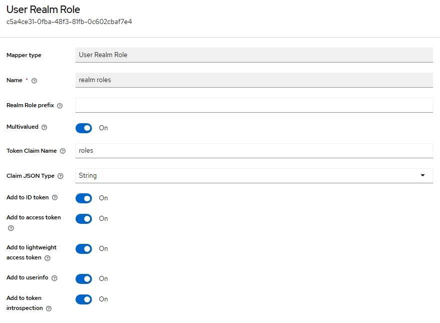

# Resource Health Deployment Guide

The **Resource Health** Building Block (BB) provides a flexible framework for monitoring the health and status of resources within the EOEPCA platform. This includes core platform services as well as derived or user-provided resources such as datasets, workflows, or user applications.

---

## Introduction

The **Resource Health BB** allows you to:

- **Define and schedule** automated health checks (e.g. daily, hourly).
- **Observe and visualise** check outcomes via a web dashboard.
- **Integrate with external services** (e.g. IAM for OIDC authentication, Data Access, Resource Catalogue).
- **Store results** in OpenSearch, optionally visualizing them using OpenSearch Dashboards.
- **Collect telemetry** via OpenTelemetry, enabling advanced monitoring and alerting.

---

## Components Overview

1. **Resource Health Web**
    
- Dashboard and front-end for viewing health checks and results.
- By default, can be secured with OIDC authentication (e.g. via Keycloak).

2. **Resource Health API(s)**
    
- **Telemetry API** for gathering check results and metrics.
- **Health Checks API** (Check Manager) for listing, scheduling, and managing checks.

3. **Health Check Runner**
    
- A flexible engine that executes your custom health checks at scheduled intervals.

4. **Mock API** (optional sample)
    
- An example test resource used in demonstration checks (e.g. an hourly check to a mock endpoint).

5. **OpenSearch & OpenSearch Dashboards**

- Stores logs, results, and trace data from your checks.
- Provides advanced visualisation and analytics features.

6. **OpenTelemetry Collector**
    
- Receives telemetry from health checks and forward them to OpenSearch.

---

## Prerequisites

Before deploying the Resource Health Building Block, ensure you have the following:

| Component                   | Requirement                             | Documentation Link                                                |
| --------------------------- | --------------------------------------- | ----------------------------------------------------------------- |
| Kubernetes                  | Cluster (tested on v1.32)               | [Installation Guide](../prerequisites/kubernetes.md) |
| Git                         | Properly installed                      | [Installation Guide](https://git-scm.com/book/en/v2/Getting-Started-Installing-Git) |
| Helm                        | Version 3.5 or newer                    | [Installation Guide](https://helm.sh/docs/intro/install/)         |
| kubectl                     | Configured for cluster access           | [Installation Guide](https://kubernetes.io/docs/tasks/tools/)     |
| Ingress Controller          | Properly installed (e.g., NGINX)        | [Installation Guide](../prerequisites/ingress/overview.md)      |
| Internal TLS Certificates   | ClusterIssuer for internal certificates | [Internal TLS Setup](../prerequisites/tls.md#internal-tls) |

**Clone the Deployment Guide Repository:**

```bash
git clone https://github.com/EOEPCA/deployment-guide
cd deployment-guide/scripts/resource-health
```

**Validate your environment:**

```bash
bash check-prerequisites.sh
```

This script checks common prerequisites, including your Kubernetes/Helm installation, Git, and any required Helm plugins.

---

## Deployment Steps

### 1. Run the Configuration Script

The `configure-resource-health.sh` script gathers basic configuration inputs (such as your internal ClusterIssuer for TLS, storage class, etc.) and generates a `generated-values.yaml` that tailors the Resource Health deployment to your environment.

```bash
bash configure-resource-health.sh
```

You'll be asked for, in order:

- **`INTERNAL_CLUSTER_ISSUER`**: Name of the cert-manager ClusterIssuer for internal TLS. (Default: `eoepca-ca-clusterissuer`)
- **`PERSISTENT_STORAGECLASS`**: Storage class for persistent volumes. (Default: `local-path`)
- **`INGRESS_HOST`**: Hostname.
- **`CLUSTER_ISSUER`**: cert-manager ClusterIssuer for TLS certificates.
- **`RESOURCE_HEALTH_ENABLE_OIDC`**: Enable OIDC protection for Resource Health. (Default: `yes`)

=== "With OIDC (default)"

    - **`RESOURCE_HEALTH_CLIENT_ID`**: Keycloak Client ID for Resource Health. (Default: `resource-health`)
    - **`KEYCLOAK_HOST`**, **`REALM`**: only asked if not already set.
    - **`KEYCLOAK_TEST_USER`**, **`KEYCLOAK_TEST_PASSWORD`**: only asked if not already set.

    Only supported with APISIX - OIDC protection is enforced at the ingress layer via an `ApisixRoute` + `openid-connect` plugin, and there is no nginx equivalent. `configure-resource-health.sh` rejects `RESOURCE_HEALTH_ENABLE_OIDC=yes` with `INGRESS_CLASS=nginx`.

=== "Without OIDC"

    Resource Health deploys with public, unauthenticated endpoints. The [Authentication](#authentication) step below isn't needed, and the Keycloak-related steps ([2](#2-create-a-keycloak-client), [5](#5-configure-keycloak-client)) can be skipped.

- **`RESOURCE_HEALTH_ENABLE_ALERTING`**: Enable email alerting for failed health checks. (Default: `no`)

=== "With alerting"

    - **`RESOURCE_HEALTH_SMTP_HOST`**, **`RESOURCE_HEALTH_SMTP_PORT`**, **`RESOURCE_HEALTH_FROM_EMAIL`**, **`RESOURCE_HEALTH_FROM_EMAIL_PASSWORD`**, **`RESOURCE_HEALTH_MAX_EMAILS_PER_DAY`**

=== "Without alerting (default)"

    The chart's alerting component is still deployed (it always is), but with placeholder SMTP values and `RESOURCE_HEALTH_MAX_EMAILS_PER_DAY=0` so it stays up without sending anything.

---

### 2. Create a Keycloak Client

!!! note
    Skip this step if `RESOURCE_HEALTH_ENABLE_OIDC=no` - `generated-iam.yaml` is only rendered when OIDC is enabled.

A Keycloak client is required for the ingress protection of the Resource Health BB. `configure-resource-health.sh` already rendered `generated-iam.yaml` (a Crossplane `Client` CRD plus its client-secret `Secret`) when OIDC was enabled - this requires [Crossplane](../prerequisites/crossplane.md) with its Keycloak provider installed and configured.

```bash
kubectl apply -f generated-iam.yaml
kubectl wait --for=condition=Ready client.openidclient.keycloak.m.crossplane.io/${RESOURCE_HEALTH_CLIENT_ID} -n iam-management --timeout=60s
```

---

### 3. Deploy the Resource Health BB (Helm)

1. **Apply Secrets**

```bash
bash apply-secrets.sh
```
This script creates the necessary secrets for the Resource Health BB (skipped if OIDC is disabled).


2. **Install or upgrade Resource Health**

The chart is published in the EOEPCA Helm charts-dev repository:

```bash
helm repo add eoepca-dev https://eoepca.github.io/helm-charts-dev/
helm repo update eoepca-dev

helm upgrade -i resource-health eoepca-dev/resource-health-reference-deployment \
  --version 2.1.1 \
  -f generated-values.yaml \
  -n resource-health --create-namespace
```

!!! note
    As part of this deployment, you will have a preconfigured healthcheck that runs every minute.

3. **Bootstrap OpenSearch security**

The OpenSearch chart mounts the security config (roles, internal users, role mappings) but does not apply it automatically. Without this step every OpenSearch-backed request (telemetry, dashboards) fails with `OpenSearch Security not initialized.`:

```bash
bash bootstrap-opensearch-security.sh
```

Re-run this any time you change OpenSearch-related values and `helm upgrade`.

---

### 4. Configure Ingress

By default, Resource Health is designed to be flexible with Ingress and OIDC configurations. OIDC protection is only supported with APISIX: it is enforced at the ingress layer via an `ApisixRoute` + `openid-connect` plugin, and there is no nginx equivalent. `configure-resource-health.sh` rejects `RESOURCE_HEALTH_ENABLE_OIDC=yes` with `INGRESS_CLASS=nginx` for this reason.

For the purpose of this guide, the configuration script created a sample Ingress resource in `generated-ingress.yaml` that you can apply or adapt to your environment. The output depends on the ingress controller you have set in the `~/.eoepca/state` file.

=== "APISIX"

    ```bash
    # Only if RESOURCE_HEALTH_ENABLE_OIDC=yes (these files are only generated in that case)
    kubectl apply -f apisix/plugin-api-auth.yaml -n resource-health
    kubectl apply -f apisix/plugin-browser-auth.yaml -n resource-health

    kubectl apply -f generated-ingress.yaml -n resource-health
    ```

=== "Nginx"

    ```bash
    kubectl apply -f generated-ingress.yaml -n resource-health
    ```

---

### 5. Configure Keycloak Client

This step only applies if OIDC is enabled. To ensure your Keycloak user has proper permissions in OpenSearch, you must configure role mapping explicitly.

=== "Crossplane"

    ```bash
    kubectl apply -f keycloak.yaml
    ```

    This creates the `opensearch_user` realm role and the client's realm-role protocol mapper. It does **not** assign the role to your test user: Crossplane's `Roles` resource needs a `user.keycloak.m.crossplane.io` `User` object to reference, but `KEYCLOAK_TEST_USER` is normally a plain Keycloak user (not a Crossplane-managed one). Assign it via the Admin REST API instead:

    ```bash
    source ~/.eoepca/state

    ADMIN_TOKEN=$(curl -s -X POST \
      -d "username=${KEYCLOAK_ADMIN_USER}" \
      --data-urlencode "password=${KEYCLOAK_ADMIN_PASSWORD}" \
      -d "grant_type=password" \
      -d "client_id=admin-cli" \
      "${HTTP_SCHEME}://${KEYCLOAK_HOST}/realms/master/protocol/openid-connect/token" \
      | jq -r '.access_token')

    USER_ID=$(curl -s -H "Authorization: Bearer ${ADMIN_TOKEN}" \
      "${HTTP_SCHEME}://${KEYCLOAK_HOST}/admin/realms/${REALM}/users?username=${KEYCLOAK_TEST_USER}" \
      | jq -r '.[0].id')

    ROLE_JSON=$(curl -s -H "Authorization: Bearer ${ADMIN_TOKEN}" \
      "${HTTP_SCHEME}://${KEYCLOAK_HOST}/admin/realms/${REALM}/roles/opensearch_user")

    curl -s -X POST \
      -H "Authorization: Bearer ${ADMIN_TOKEN}" -H "Content-Type: application/json" \
      -d "[${ROLE_JSON}]" \
      "${HTTP_SCHEME}://${KEYCLOAK_HOST}/admin/realms/${REALM}/users/${USER_ID}/role-mappings/realm"
    ```

    !!! note
        This uses the `master` realm for the admin token, since `admin-cli`'s default admin account normally isn't a user of your own realm. If `KEYCLOAK_ADMIN_USER` is a user of `${REALM}` instead, use `${REALM}` here.

=== "Manual"

    #### Step 1: Create a Keycloak Realm Role

    * Log into your Keycloak (`auth.${INGRESS_HOST}`).
    * Navigate to your realm (`eoepca`).
    * Click on **Realm Roles**, then click **Create Role**.
    * Create a new role named `opensearch_user`

    #### Step 2: Assign the Role to your Keycloak User

    * Still in Keycloak, go to **Users** and select your user (e.g. `eoepcauser`).
    * Click on the **Role Mappings** tab.
    * Assign the newly created `opensearch_user` realm role to this user.

    #### Step 3: Add the Realm Role Mapper to your Keycloak Client

    * Go to **Clients** and select your `resource-health` client.
    * Navigate to **Client Scopes → resource-health-dedicated** and click **Add Mapper**.
    * Configure the `User Realm Role` template mapper as follows:

    | Field               | Value                |
    | ------------------- | -------------------- |
    | Mapper Type         | `User Realm Role`    |
    | Name                | `realm roles`        |
    | Multivalued         | `ON` ✅               |
    | Token Claim Name    | `roles`              |
    | Claim JSON Type     | `String`             |
    | Add to ID token     | `ON` ✅               |
    | Add to Access token | `ON` ✅               |
    | Add to Userinfo     | `ON` (recommended) ✅ |

    This configuration ensures Keycloak will correctly include realm roles in the JWT.

    

---

### 6. Monitor the Deployment

Once deployed, you will have to wait a minute until the first health check runs before you can access the Resource Health Web dashboard.

After the Helm installation finishes, check that all pods are running in the **resource-health** namespace:

```bash
kubectl get all -n resource-health
```

---

## Validation

1. **Run the validation script**:
    
```bash
bash validation.sh
```

---

## Usage

### Authentication

=== "With OIDC (default)"

    The Resource Health APIs are protected by OIDC authentication. Before making API requests, obtain an access token:

    ```bash
    source ~/.eoepca/state

    ACCESS_TOKEN=$(curl -s -X POST "https://auth.${INGRESS_HOST}/realms/eoepca/protocol/openid-connect/token" \
      -H "Content-Type: application/x-www-form-urlencoded" \
      -d "grant_type=password" \
      -d "client_id=${RESOURCE_HEALTH_CLIENT_ID}" \
      -d "client_secret=${RESOURCE_HEALTH_CLIENT_SECRET}" \
      -d "username=${KEYCLOAK_TEST_USER}" \
      -d "password=${KEYCLOAK_TEST_PASSWORD}" \
      | jq -r '.access_token')

    echo "Access Token: ${ACCESS_TOKEN:0:50}..."
    ```

    Alternatively, for machine-to-machine access without a user context, use the client credentials grant:

    ```bash
    ACCESS_TOKEN=$(curl -s -X POST "https://auth.${INGRESS_HOST}/realms/eoepca/protocol/openid-connect/token" \
      -H "Content-Type: application/x-www-form-urlencoded" \
      -d "grant_type=client_credentials" \
      -d "client_id=${RESOURCE_HEALTH_CLIENT_ID}" \
      -d "client_secret=${RESOURCE_HEALTH_CLIENT_SECRET}" \
      | jq -r '.access_token')
    ```

=== "Without OIDC"

    No token is needed. Omit the `-H "Authorization: Bearer ${ACCESS_TOKEN}"` header from all curl commands below.

---

### View Available Templates

Health check templates define reusable patterns for common monitoring scenarios:

```bash
curl -s "https://resource-health.${INGRESS_HOST}/api/healthchecks/v1/check_templates/" \
  -H "Authorization: Bearer ${ACCESS_TOKEN}" \
  | jq '.data[].id'
```

The default deployment includes:
- **simple_ping** - Checks if an endpoint responds with an expected HTTP status code
- **generic_script_template** - Runs custom pytest scripts for advanced health checks

To view details of a specific template:

```bash
curl -s "https://resource-health.${INGRESS_HOST}/api/healthchecks/v1/check_templates/simple_ping" \
  -H "Authorization: Bearer ${ACCESS_TOKEN}" | jq
```

---

### Create a Health Check

The Resource Health API uses [JSON:API](https://jsonapi.org/) format. Let's create a health check that verifies Google is reachable:

```bash
cat <<EOF | tee healthcheck-google.json | jq
{
  "data": {
    "type": "check",
    "attributes": {
      "schedule": "*/1 * * * *",
      "metadata": {
        "name": "google-ping-check",
        "description": "Check if Google is reachable",
        "template_id": "simple_ping",
        "template_args": {
          "endpoint": "https://www.google.com",
          "expected_status_code": 200
        }
      }
    }
  }
}
EOF
```

Register the health check:

```bash
curl -X POST "https://resource-health.${INGRESS_HOST}/api/healthchecks/v1/checks/" \
  -H "Authorization: Bearer ${ACCESS_TOKEN}" \
  -H "Content-Type: application/vnd.api+json" \
  -d @healthcheck-google.json | jq
```

Note the `id` field in the response - this is the UUID assigned to your health check.

---

### List Health Checks

View all registered health checks:

```bash
curl -s "https://resource-health.${INGRESS_HOST}/api/healthchecks/v1/checks/" \
  -H "Authorization: Bearer ${ACCESS_TOKEN}" \
  | jq '.data[] | {id: .id, name: .attributes.metadata.name, schedule: .attributes.schedule}'
```

The health check is implemented as a Kubernetes CronJob:

```bash
kubectl get cronjobs -n resource-health
```

The CronJob name matches the UUID of the health check.

---

### Trigger a Health Check Manually

Rather than waiting for the scheduled time, you can trigger a health check immediately:

```bash
# Get the check ID
CHECK_ID=$(curl -s "https://resource-health.${INGRESS_HOST}/api/healthchecks/v1/checks/" \
  -H "Authorization: Bearer ${ACCESS_TOKEN}" \
  | jq -r '.data[0].id')
echo "Check ID: $CHECK_ID"

# Create a manual job from the CronJob
kubectl create job --from=cronjob/${CHECK_ID} manual-google-check -n resource-health

# Wait for completion
kubectl wait --for=condition=complete job/manual-google-check -n resource-health --timeout=120s

# View results
kubectl logs job/manual-google-check -n resource-health --all-containers 2>/dev/null | tail -15
```

You should see pytest output showing the test passed.

---

### View Health Check Results

**Via Telemetry API:**

```bash
curl -s "https://resource-health.${INGRESS_HOST}/api/telemetry/v1/spans" \
  -H "Authorization: Bearer ${ACCESS_TOKEN}" | jq
```

!!! note
    Omit the trailing slash: `/v1/spans/` triggers a 307 redirect to a plain
    `http://` URL (a self-referential-link bug in the telemetry API), which
    most HTTP clients then refuse to follow over an HTTPS connection.

If no data appears yet, wait a moment for the checks to complete and telemetry to be collected.

**Via Web Dashboard:**

Visit `https://resource-health.${INGRESS_HOST}` to see all health checks and their results in a visual interface.

**Via OpenSearch Dashboards:**

Visit `https://resource-health.${INGRESS_HOST}/dashboards` to query the raw `ss4o_traces-*` indices directly. With OIDC disabled, log in with `admin`/`admin`.

---

### Delete a Health Check

```bash
# Get the check ID
CHECK_ID=$(curl -s "https://resource-health.${INGRESS_HOST}/api/healthchecks/v1/checks/" \
  -H "Authorization: Bearer ${ACCESS_TOKEN}" \
  | jq -r '.data[] | select(.attributes.metadata.name=="google-ping-check") | .id')
echo "Deleting check: $CHECK_ID"

# Delete the check
curl -X DELETE "https://resource-health.${INGRESS_HOST}/api/healthchecks/v1/checks/${CHECK_ID}" \
  -H "Authorization: Bearer ${ACCESS_TOKEN}"

# Verify deletion
curl -s "https://resource-health.${INGRESS_HOST}/api/healthchecks/v1/checks/" \
  -H "Authorization: Bearer ${ACCESS_TOKEN}" \
  | jq '.data[].attributes.metadata.name'
```

The corresponding CronJob should also be deleted:

```bash
kubectl get cronjobs -n resource-health
```

---

### Defining Health Checks via Helm

Health checks can also be pre-configured in the Helm values. Add templates under `resource-health.healthchecks.templates`:

```yaml
resource-health:
  healthchecks:
    use_template_configmap: True
    templates:
      my_custom_template.py: |
        import check_backends.k8s_backend.template_utils as tu

        CUSTOM_SCRIPT = """
        import requests
        from os import environ

        def test_custom_check():
            response = requests.get(environ["TARGET_URL"])
            assert response.status_code == 200
            assert "expected_content" in response.text
        """

        class CustomCheckArguments(tu.BaseModel):
            model_config = tu.ConfigDict(extra="forbid")
            target_url: str = tu.Field(json_schema_extra={"format": "textarea"})

        CustomCheck = tu.simple_runner_template(
            template_id="custom_check",
            argument_type=CustomCheckArguments,
            label="Custom Check Template",
            description="A custom health check template",
            script_url=tu.src_to_data_url(CUSTOM_SCRIPT),
            runner_env=lambda template_args, userinfo: {
                "TARGET_URL": template_args.target_url,
            },
            user_id=lambda template_args, userinfo: userinfo["username"],
            otlp_tls_secret="resource-health-healthchecks-certificate",
        )
```

Apply the updated configuration:

```bash
helm upgrade resource-health eoepca-dev/resource-health-reference-deployment \
  --version 2.1.1 \
  -f generated-values.yaml \
  -n resource-health
```

---

### Creating Health Checks via Web UI

1. Visit the Resource Health Web dashboard at `https://resource-health.${INGRESS_HOST}`
2. Click on **Create new check**
3. Select a template (e.g., "Simple ping template")
4. Fill in the required fields:
   - **Name**: A descriptive name for your check
   - **Description**: What this check monitors
   - **Schedule**: A cron expression (e.g., `*/5 * * * *` for every 5 minutes)
   - **Template Arguments**: Endpoint URL, expected status code, etc.
5. Click **Create** to register the health check

The check will immediately appear in the dashboard and begin running according to its schedule.


## Uninstallation

To uninstall Resource Health and clean up associated resources:

```bash
source ~/.eoepca/state

kubectl delete -f generated-ingress.yaml --ignore-not-found
kubectl delete -f apisix/plugin-api-auth.yaml -n resource-health --ignore-not-found
kubectl delete -f apisix/plugin-browser-auth.yaml -n resource-health --ignore-not-found

helm uninstall resource-health -n resource-health || true
kubectl delete namespace resource-health --ignore-not-found

if [ "${RESOURCE_HEALTH_ENABLE_OIDC:-no}" = "yes" ]; then
  kubectl delete -f keycloak.yaml --ignore-not-found
  kubectl delete -f generated-iam.yaml --ignore-not-found
fi
```

---

## Further Reading

- [EOEPCA+ Resource Health GitHub](https://github.com/EOEPCA/resource-health)
- [EOEPCA+ Helm Charts](https://eoepca.github.io/helm-charts)
- [EOEPCA+ Deployment Guide Repository](https://github.com/EOEPCA/deployment-guide)
- [OpenSearch Documentation](https://opensearch.org/docs/)
- [OpenTelemetry Documentation](https://opentelemetry.io/)
