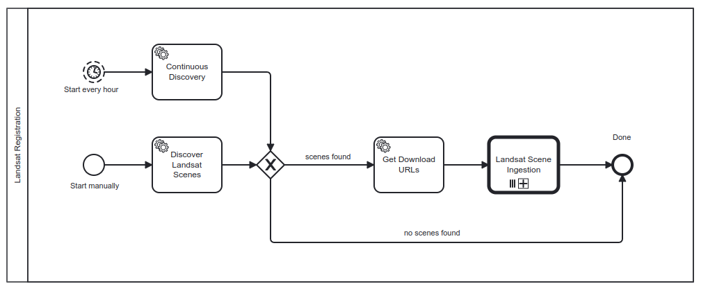
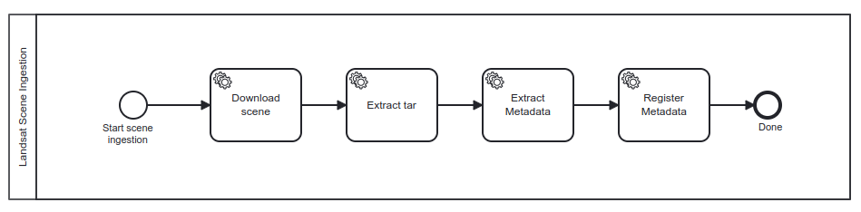

# Resource Registration Deployment Guide

The **Resource Registration** Building Block enables data and metadata ingestion into platform services. It handles:

- Metadata registration into Resource Discovery
- Data registration into Data Access services
- Resource visualisation configuration

---

## Introduction

The **Resource Registration Building Block** manages resource ingestion into the platform for discovery, access and collaboration. It supports:

- Datasets (EO data, auxiliary data)
- Processing workflows 
- Jupyter Notebooks
- Web services and applications
- Documentation and metadata

The BB integrates with other platform services to enable:

- Automated metadata extraction
- Resource discovery indexing
- Access control configuration
- Usage tracking

---

## Components Overview

The Resource Registration BB comprises three main components:

1. **Registration API**  
An OGC API Processes interface for registering, updating, or deleting resources on the local platform.
    
2. **Harvester**  
Automates workflows (via Flowable BPMN) to harvest data from external sources and register them in the platform.
    
3. **Common Registration Library**  
A Python library consolidating upstream packages (e.g. STAC tools, eometa tools) for business logic in workflows and resource handling.

---

## Prerequisites

Before deploying the Resource Registration Building Block, ensure you have the following:

| Component          | Requirement                            | Documentation Link                                                |
| ------------------ | -------------------------------------- | ----------------------------------------------------------------- |
| Kubernetes         | Cluster (tested on v1.28)              | [Installation Guide](../prerequisites/kubernetes.md)             |
| Helm               | Version 3.7 or newer                   | [Installation Guide](https://helm.sh/docs/intro/install/)         |
| kubectl            | Configured for cluster access          | [Installation Guide](https://kubernetes.io/docs/tasks/tools/)     |
| TLS Certificates   | Managed via `cert-manager` or manually | [TLS Certificate Management Guide](../prerequisites/tls.md) |
| Ingress Controller | Properly installed (e.g., NGINX)       | [Installation Guide](../prerequisites/ingress/overview.md)      |


**Clone the Deployment Guide Repository:**

```bash
git clone https://github.com/EOEPCA/deployment-guide
cd deployment-guide/scripts/resource-registration
```

**Validate your environment:**

Run the validation script to ensure all prerequisites are met:

```bash
bash check-prerequisites.sh
```

---

## Deployment Steps

### 1. Run the Configuration Script

Generate configuration files and prepare deployment:

```bash
bash configure-resource-registration.sh
```

**Configuration Parameters**

During the script execution, you will be prompted to provide:

- **`INGRESS_HOST`**: Base domain for ingress hosts.
    - *Example*: `example.com`
- **`CLUSTER_ISSUER`**: Cert-Manager ClusterIssuer for TLS certificates.
    - *Example*: `letsencrypt-http01-apisix`
- **`FLOWABLE_ADMIN_USER`**: Admin username for Flowable.
    - *Default*: `eoepca`
- **`FLOWABLE_ADMIN_PASSWORD`**: Admin password for Flowable.
    - *Default*: `eoepca`


### 2. Apply Kubernetes Secrets

Create required secrets:

```bash
bash apply-secrets.sh
```

**Secrets Created:**

- `flowable-admin-credentials`:<br>
  _Contains Flowable admin username and password_

### 3. Deploy the Registration API Using Helm

Deploy the Registration API using the generated values file.

```bash
helm repo add eoepca-dev https://eoepca.github.io/helm-charts-dev
helm repo update eoepca-dev
helm upgrade -i registration-api eoepca-dev/registration-api \
  --version 2.0.0-rc2 \
  --namespace resource-registration \
  --create-namespace \
  --values registration-api/generated-values.yaml
```

Deploy the ingress for the Registration API:

```bash
kubectl apply -f registration-api/generated-ingress.yaml
```

### 4. Deploy the Registration Harvester Using Helm

**Deploy Flowable Engine:**

```bash
helm repo add flowable https://flowable.github.io/helm/
helm repo update flowable
helm upgrade -i registration-harvester-api-engine flowable/flowable \
  --version 7.0.0 \
  --namespace resource-registration \
  --create-namespace \
  --values registration-harvester/generated-values.yaml
```

Deploy the ingress for the Flowable Engine:

```bash
kubectl apply -f registration-harvester/generated-ingress.yaml
```

**Deploy Registration Harvester Worker:**

By way of example, a `worker` is deployed that harvests `Landast` data from [USGS](https://landsatlook.usgs.gov/stac-server).

```bash
helm repo add eoepca-dev https://eoepca.github.io/helm-charts-dev
helm repo update eoepca-dev
# Version 2.0.0-rc2-pr-63 pending PR #63 - https://github.com/EOEPCA/helm-charts-dev/pull/63
helm upgrade -i landsat-harvester-worker eoepca-dev/registration-harvester \
  --version 2.0.0-rc2-pr-63 \
  --namespace resource-registration \
  --create-namespace \
  --values registration-harvester/generated-values.yaml
```

The Landsat harvester relies upon credentials for the USGS service. These can be obtained via free sign-up at the [USGS Machine-to-Machine (M2M) API](https://m2m.cr.usgs.gov/).

The Landsat harvester worker expects a Kubernetes secret that provides these (and other) credentials.

The [Generate Application Token](https://ers.cr.usgs.gov/password/appgenerate) page should be used to create a token with the `M2M API` scope - which can then be set into the following environment variables for inclusion in the secret.

```bash
export M2M_USER='your-username'
export M2M_PASSWORD='your-generated-token'
```

Now we can create the `landsat-harvester-secret` Kubernetes secret that is expected by the Landsat harvester worker.

```bash
source ~/.eoepca/state
kubectl create secret generic landsat-harvester-secret \
  --from-literal=FLOWABLE_USER="$FLOWABLE_ADMIN_USER" \
  --from-literal=FLOWABLE_PASSWORD="$FLOWABLE_ADMIN_PASSWORD" \
  --from-literal=M2M_USER="${M2M_USER}" \
  --from-literal=M2M_PASSWORD="${M2M_PASSWORD}" \
  --namespace resource-registration \
  --dry-run=client -o yaml | kubectl apply -f -
```

### 5. Monitor the Deployment

Check the status of the deployments:

```bash
kubectl get all -n resource-registration
```

---

## Validation and Usage

**Check Kubernetes Resources:**

Ensure that all Kubernetes resources are running correctly.

```bash
kubectl get pods -n resource-registration
```

* All pods should be in the `Running` state.
* No pods should be in `CrashLoopBackOff` or `Error` states.

**Automated Validation:**

This script performs a series of automated tests to validate the deployment.

```bash
bash validation.sh
```

---

**Registration API Home:**

This page provides basic information about the Registration API.

```bash
source ~/.eoepca/state
xdg-open "${HTTP_SCHEME}://registration-api.${INGRESS_HOST}/"
```
 

**Swagger UI Documentation:**

Interactive API documentation allowing you to explore and test the Registration API endpoints.

```bash
source ~/.eoepca/state
xdg-open "${HTTP_SCHEME}://registration-api.${INGRESS_HOST}/openapi?f=html"
``` 

**Flowable REST API Swagger UI:**

Provides Swagger UI documentation for the Flowable REST API.

```bash
source ~/.eoepca/state
xdg-open "${HTTP_SCHEME}://registration-harvester-api.${INGRESS_HOST}/flowable-rest/docs/"
```

---

### Registering Resources

Resource Registration relies on an **OGC API Processes** interface, through which it provides the _Registration API_ interfaces:

* Registration: `POST /processes/register/execution`
* De-registration: `POST /processes/deregister/execution`

These interfaces are illustrated below.

#### Example - Registering a Collection

This example registers a `Collection` resource into the EOEPCA Resource Catalogue instance.

> This assumes that the [Resource Discovery](resource-discovery.md) Building Block has been deployed - offering a STAC endpoint.

Use the following command to register an STAC Collection `landsat-ot-c2-l2` - representing the `Landsat 8-9 OLI/TIRS Collection 2 Level-2`.

> This collection is used in later steps as a target for harvesting of some example Landsat data.

```bash
source ~/.eoepca/state
curl -X POST "https://registration-api.${INGRESS_HOST}/processes/register/execution" \
  -H "Content-Type: application/json" \
  -d @- <<EOF
{
    "inputs": {
        "source": {"rel": "collection", "href": "https://raw.githubusercontent.com/EOEPCA/registration-harvester/refs/heads/main/etc/collections/landsat/landsat-ot-c2-l2.json"},
        "target": {"rel": "https://api.stacspec.org/v1.0.0/core", "href": "https://resource-catalogue.${INGRESS_HOST}/stac"}
    }
}
EOF
```

- **source**: A valid STAC Collection URL (in this example, hosted on GitHub).<br>
  _(Adjust this path according to your input.)_
- **target**: Your STAC server endpoint where the resource is to be registered.

#### Validating the Registration

```bash
source ~/.eoepca/state
xdg-open "${HTTP_SCHEME}://registration-api.${INGRESS_HOST}/jobs"
```

You should see a new job with the status `COMPLETED`. 

If you have deployed the [**Resource Discovery**](./resource-discovery.md) Building Block, then the registered `Collection` will also be available at:

```bash
source ~/.eoepca/state
xdg-open "${HTTP_SCHEME}://resource-catalogue.${INGRESS_HOST}/collections/landsat-ot-c2-l2"
```

#### Collection De-registration

Demonstrates use of the API for resource deregistration...

> Skip this step if you are intending to perform the example harvesting of Landsat data - as is illustrated in later steps.

```bash
source ~/.eoepca/state
curl -X POST "https://registration-api.${INGRESS_HOST}/processes/deregister/execution" \
  -H "Content-Type: application/json" \
  -d @- <<EOF
{
    "inputs": {
        "id": "landsat-ot-c2-l2",
        "rel": "collection",
        "target": {"rel": "https://api.stacspec.org/v1.0.0/core", "href": "https://resource-catalogue.${INGRESS_HOST}/stac"}
    }
}
EOF
```

### Using the Registration Harvester

The Registration Harvester leverages Flowable to automate resource harvesting workflows.

**Access the Flowable REST API Swagger UI:**

```bash
source ~/.eoepca/state
xdg-open "${HTTP_SCHEME}://registration-harvester-api.${INGRESS_HOST}/flowable-rest/docs/"
```

**List Deployed Workflows**

Initially only the built-in `Demo processes` workflow is deployed.

```bash
source ~/.eoepca/state
curl -s "https://registration-harvester-api.${INGRESS_HOST}/flowable-rest/service/repository/deployments" \
  -u ${FLOWABLE_ADMIN_USER}:${FLOWABLE_ADMIN_PASSWORD} \
  | jq -r '.data[] | "\(.deploymentTime): \(.name)" '
```

The `Demo processes` workflow provides a number of example processes.

```bash
source ~/.eoepca/state
curl -s "https://registration-harvester-api.${INGRESS_HOST}/flowable-rest/service/repository/process-definitions" \
  -u ${FLOWABLE_ADMIN_USER}:${FLOWABLE_ADMIN_PASSWORD} \
  | jq -r '.data[] | "\(.key): \(.name)" '
```

#### Example - Deploy Workflow for Landsat harvesting

Earlier in this page we deployed the Landsat harvester worker, which is implemented to respond to a specific set of workflow topics - as described by the values deployed with the helm chart:

* landsat_discover_data (LandsatDiscoverHandler)
* landsat_continuous_data_discovery (LandsatContinuousDiscoveryHandler)
* landsat_get_download_urls (LandsatGetDownloadUrlHandler)
* landsat_download_data (LandsatDownloadHandler)
* landsat_untar (LandsatUntarHandler)
* landsat_extract_metadata (LandsatExtractMetadataHandler)
* landsat_register_metadata (LandsatRegisterMetadataHandler)

To exploit this we deploy the Landsat workflow, comprising two BPMN processes. The main process (Landsat Registration) searches for new data at USGS. For each new scene found, the workflow executes another process (Landsat Scene Ingestion) which performs the individual steps for harvesting and registering the data.

**Workflow - Landsat Registration (main)**

Deploy the BPMN workflow `landsat.bpmn` by `POST` to the Flowable service...

```bash
source ~/.eoepca/state
curl -s https://raw.githubusercontent.com/EOEPCA/registration-harvester/refs/heads/main/workflows/landsat.bpmn | \
curl -s -X POST "https://registration-harvester-api.${INGRESS_HOST}/flowable-rest/service/repository/deployments" \
  -u ${FLOWABLE_ADMIN_USER}:${FLOWABLE_ADMIN_PASSWORD} \
  -F "landsat.bpmn=@-;filename=landsat.bpmn;type=text/xml" | jq
```



**Sub-Workflow Landsat Scene Ingestion**

Deploy the BPMN sub-workflow `landsat-scene-ingestion.bpmn` by `POST` to the Flowable service...

```bash
source ~/.eoepca/state
curl -s https://raw.githubusercontent.com/EOEPCA/registration-harvester/refs/heads/main/workflows/landsat-scene-ingestion.bpmn | \
curl -s -X POST "https://registration-harvester-api.${INGRESS_HOST}/flowable-rest/service/repository/deployments" \
  -u ${FLOWABLE_ADMIN_USER}:${FLOWABLE_ADMIN_PASSWORD} \
  -F "landsat-scene-ingestion.bpmn=@-;filename=landsat-scene-ingestion.bpmn;type=text/xml" | jq
```



**List Deployed Workflows**

Now the landsat **_workflows_** and associated **_processes_** should be listed as deployed.

_Workflows..._

```bash
source ~/.eoepca/state
curl -s "https://registration-harvester-api.${INGRESS_HOST}/flowable-rest/service/repository/deployments" \
  -u ${FLOWABLE_ADMIN_USER}:${FLOWABLE_ADMIN_PASSWORD} \
  | jq -r '.data[] | "\(.deploymentTime): \(.name)" '
```

_Processes..._

```bash
# Retrieve processes
processes="$( \
  curl -s "https://registration-harvester-api.${INGRESS_HOST}/flowable-rest/service/repository/process-definitions" \
    -u "${FLOWABLE_ADMIN_USER}:${FLOWABLE_ADMIN_PASSWORD}" \
  )"

echo -e "\nProcess listing..."
echo "$processes" | jq -r '.data[] | "\(.key): \(.name)"'

# Extract Landsat Workflow process ID
landsat_process_id="$(echo "$processes" | jq -r '[.data[] | select(.name == "Landsat Workflow")][0].id')"
echo -e "\nLandsat process ID: ${landsat_process_id}"
```

#### Invoke Landsat Harvesting Workflow

```bash
source ~/.eoepca/state
curl -s -X POST "https://registration-harvester-api.${INGRESS_HOST}/flowable-rest/service/runtime/process-instances" \
  -u "${FLOWABLE_ADMIN_USER}:${FLOWABLE_ADMIN_PASSWORD}" \
  -H "Content-Type: application/json" \
  -d @- <<EOF | jq
{
  "processDefinitionId": "$landsat_process_id",
  "variables": [
    {
      "name": "datetime_interval",
      "type": "string",
      "value": "2024-11-13T10:00:00Z/2024-11-13T11:00:00Z"
    },
    {
      "name": "collections",
      "type": "string",
      "value": "landsat-c2l2-sr"
    },
    {
      "name": "bbox",
      "type": "string",
      "value": "-7,46,3,52"
    }
  ]
}
EOF
```

#### Monitor the job progress

**_Logs..._**

```bash
kubectl -n resource-registration logs -f  deploy/landsat-harvester-worker
```

**_Process instances..._**

Expecting an instance of the main `Landsat Workflow` process, and for each scene discovered, an instance of the `Landsat Scene Ingestion` process.

> This may take a few minutes to complete.

```bash
source ~/.eoepca/state
curl -s "https://registration-harvester-api.${INGRESS_HOST}/flowable-rest/service/runtime/process-instances" \
  -u ${FLOWABLE_ADMIN_USER}:${FLOWABLE_ADMIN_PASSWORD} \
  | jq -r '.data[] | "\(.startTime) | \(.id) | \(.processDefinitionName)"'

```

#### Check the Catalogue collection

Expecting 5 scenes registered into the Landsat collection.

> This may take a few minutes to complete.

```bash
source ~/.eoepca/state
xdg-open "https://resource-catalogue.${INGRESS_HOST}/collections/landsat-ot-c2-l2/items"
```

---

### Delivery of data `assets`

The default harvesting approach illustrated above maintains the harvested assets into an `eodata` persistent volume. The metadata records registered with the catalogue assume delivery of these assets via the base URL `https://eodata.${INGRESS_HOST}/` - such that the registered _STAC Items_ include asset hrefs that are rooted under this base URL.

#### Example - Service for asset access

By way of an example, a simple NGINX service can be deployed to provide access to these assets - under the service URL `https://eodata.${INGRESS_HOST}/` - to correctly resolve the asset hrefs as registered in the STAC Items.

```bash
kubectl apply -f registration-harvester/generated-eodata-server.yaml
```

#### Visualise with STAC Browser

Use STAC Browser to navigate the harvested STAC Collection and the referenced assets.

```bash
source ~/.eoepca/state
xdg-open "https://radiantearth.github.io/stac-browser/#/external/resource-catalogue.${INGRESS_HOST}/stac/"
```

---

## Uninstallation

To uninstall the Resource Registration Building Block and clean up associated resources:

```bash
helm uninstall landsat-harvester-worker -n resource-registration
kubectl delete -f registration-harvester/generated-ingress.yaml
helm uninstall registration-harvester-api-engine -n resource-registration
kubectl delete -f registration-api/generated-ingress.yaml
helm uninstall registration-api -n resource-registration

kubectl delete namespace resource-registration
```

---

## Further Reading

- [EOEPCA+ Resource Registration GitHub Repository](https://github.com/EOEPCA/resource-registration)
- [Flowable BPMN Platform](https://flowable.com/open-source/)
- [pygeoapi Documentation](https://pygeoapi.io/)
- [EOEPCA+ Helm Charts](https://eoepca.github.io/helm-charts-dev)
