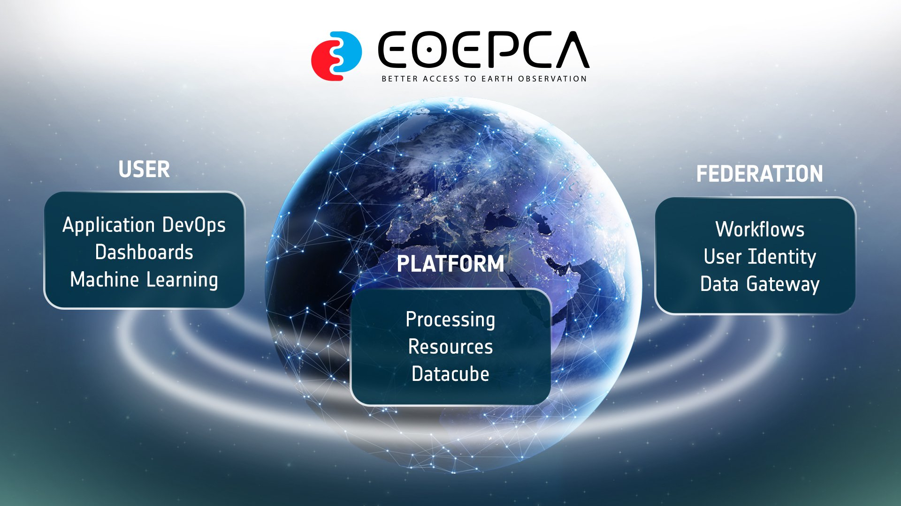

# EOEPCA+ Deployment Guide

{ .centered }

The EOEPCA+ Deployment Guide walks you through deploying the EOEPCA+ platform - a modular set of **Building Blocks** for Earth Observation data discovery, access, processing and collaboration - onto your own Kubernetes cluster.

!!! tip "Release 2.1"
    The second formal release of EOEPCA+, building on Release 2.0 with a full refresh of the Building Blocks - more capable, more stable, and ready for production deployment. See the [Changelog](changelog.md) for what's new.

## Get Started

-   :material-server-network:{ .lg .middle } **1. Prerequisites**

    ---

    Set up the foundational infrastructure - Kubernetes, ingress, TLS and storage - that every Building Block relies on.

    [:octicons-arrow-right-24: Prerequisites](prerequisites/prerequisites-overview.md)

-   :material-cube-outline:{ .lg .middle } **2. Building Blocks**

    ---

    Deploy the Building Blocks that make up the EOEPCA+ platform, from Identity & Access through to Processing and Workspaces.

    [:octicons-arrow-right-24: Building Blocks Overview](building-blocks/overview.md)

!!! note "Request for Support"
    If you have a question or require some technical support, then please <a href="https://github.com/EOEPCA/community-support/issues/new?template=eoepca-support-request.yaml" target="_blank" rel="noopener noreferrer">Raise a Support Request</a> via <a href="https://github.com/EOEPCA/community-support/issues/new?template=eoepca-support-request.yaml" target="_blank" rel="noopener noreferrer">this form</a>.

## How Deployment Works

Every Building Block is deployed the same way, via **Helm charts** configured through a small set of scripts - so once you've deployed one, the rest follow a familiar pattern:

1. **Check prerequisites** - each Building Block lists what it needs, typically Kubernetes, Helm, and any specific storage or ingress requirements.
2. **Configure** - a `configure-<component>.sh` script asks for domain names, storage classes, TLS settings and the like, then generates the Helm `values.yaml` and any other config files.
3. **Deploy and validate** - install via Helm, then run the accompanying `validation.sh` script to confirm it deployed correctly and is functioning as expected.
4. **State is shared** - configuration and generated secrets are saved to `~/.eoepca/state`, so later Building Blocks can reuse settings from earlier ones.

!!! note
    The first configuration script you run asks whether to use Cert-Manager for TLS. If you opt out, you'll need to create TLS secrets manually before deploying each Building Block.
